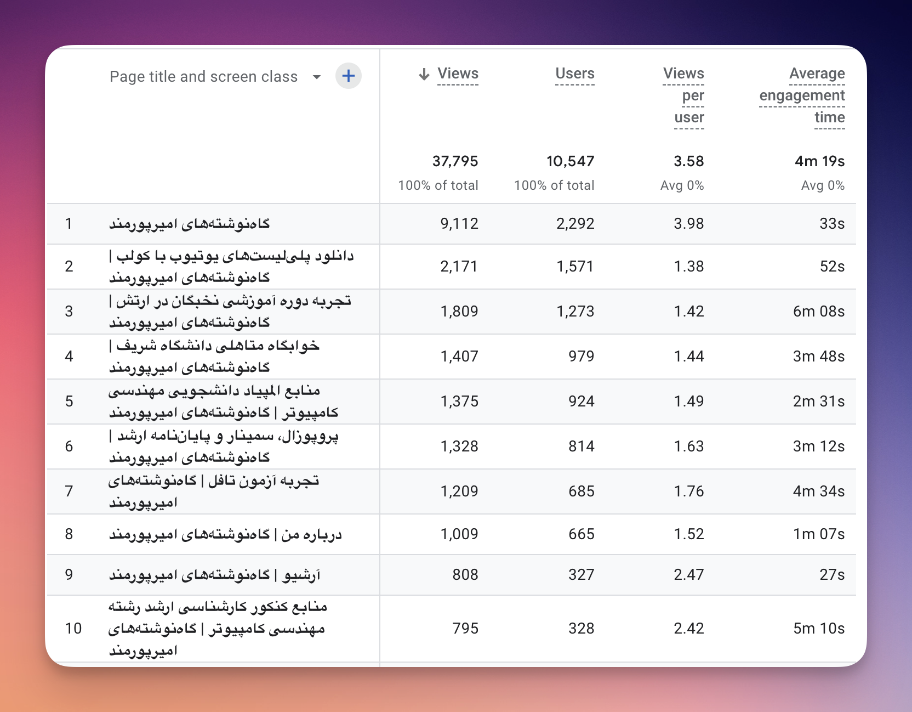
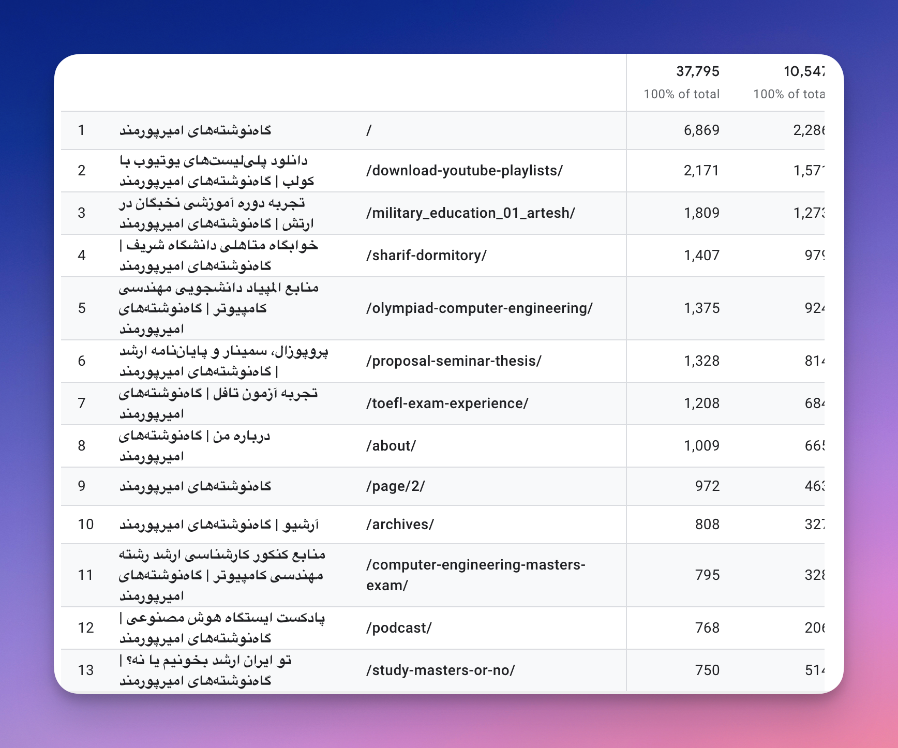

- [دانلود پلی‌لیست‌های یوتیوب با کولب](https://aprd.ir/download-youtube-playlists/)
- [تجربه دوره آموزشی نخبگان در ارتش](https://aprd.ir/military_education_01_artesh/)
- [خوابگاه متاهلی دانشگاه شریف](https://aprd.ir/sharif-dormitory/)
- [منابع المپیاد دانشجویی مهندسی کامپیوتر](https://aprd.ir/olympiad-computer-engineering/)
- [پروپوزال،‌ سمینار و پایان‌نامه ارشد](https://aprd.ir/proposal-seminar-thesis/)
- [تجربه آزمون تافل](https://aprd.ir/toefl-exam-experience/)
- [منابع کنکور کارشناسی ارشد رشته مهندسی کامپیوتر](https://aprd.ir/computer-engineering-masters-exam/)
- [پادکست ایستگاه هوش‌ مصنوعی](https://aprd.ir/podcast/)
- [تو ایران ارشد بخونیم یا نه؟](https://aprd.ir/study-masters-or-no/)
- [در ستایش نرم‌افزار Obsidian](https://aprd.ir/about-obsidian/)
- [پرسش و پاسخ کنکوری و المپیادی](https://aprd.ir/questions-olympiad-konkur/)
- [دیرآموخته‌های دوران ارشد](https://aprd.ir/late-lessons-academia/)
- [گزارش توسعه فردی مرداد ۱۴۰۲](https://aprd.ir/personal-development-mordad-1402/)
- [آموزش ساخت وب‌سایت شخصی استاتیک - قسمت یک](https://aprd.ir/create-your-own-website-part1/)
- [دانستنی‌های اینترنت شریف](https://aprd.ir/login-sharif/)
- [رم (RAM)، رام (ROM)، کارت‌ حافظه (SD-Card) و حافظه داخلی](https://aprd.ir/ram-rom-sdcard-internal-memory/)
- [گزارش توسعه فردی آذر ۱۴۰۲](https://aprd.ir/personal-development-azar-1402/)
- [گزارش توسعه فردی بهمن ۱۴۰۲](https://aprd.ir/personal-developement-bahman-1402/)
- [مدل‌های زبانی بزرگ و نحوه آموزش آن‌ها](https://aprd.ir/large-language-models-training/)
- [پایان‌نامه، دفاع و فارغ‌التحصیلی ارشد](https://aprd.ir/thesis-defense-gradudation/)
- [گزارش توسعه فردی مهر ۱۴۰۲](https://aprd.ir/personal-development-mehr-1402/)
- [چگونه کتاب‌ها و مقالات انگلیسی رو دانلود کنیم؟](https://aprd.ir/how-to-download-articles-and-books/)
- [گزارش توسعه فردی دی ۱۴۰۲](https://aprd.ir/personal-development-dey-1402/)
- [گزارش توسعه فردی آبان ۱۴۰۲](https://aprd.ir/personal-development-aban-1402/)
- [گزارش توسعه فردی شهریور ۱۴۰۲](https://aprd.ir/personal-development-shahrivar-1402/)
- [گزارش توسعه فردی اسفند ۱۴۰۲](https://aprd.ir/personal-development-esfand-1402/)
- [کانال‌ها و وبلاگ‌های مورد علاقه‌ من](https://aprd.ir/my-favorite-blogs-and-channels/)
- [بوک‌مارک‌های من](https://aprd.ir/bookmarks/)
- [توسعه_فردی](https://aprd.ir/fatags/توسعه_فردی/)
- [یادگیری ماشین به زبان ساده](https://aprd.ir/simple-machine-learning-explanation/)
- [مقایسه کشورها از نظر یک مهاجر ایرانی](https://aprd.ir/country-comparison-for-immigrants/)
- [گزارش توسعه فردی فروردین ۱۴۰۳](https://aprd.ir/personal-development-farvardin-1403/)
- [آموزش ساخت وب‌سایت شخصی استاتیک - قسمت دوم](https://aprd.ir/create-your-own-website-part2/)
- [معیارهای من در انتخاب گوشی‌ اندرویدی](https://aprd.ir/buying-android-phones/)
- [تبدیل صوت به متن و خلاصه‌سازی - بررسی موردی درس گفتار سادگی و ساده‌زیستی](https://aprd.ir/asr-summarization-pipeline-simplicity/)
- [متن اپیزودهای پادکست](https://aprd.ir/transcripts/)
- [تکنیک‌های کارکردن با مدل‌های زبانی بزرگ - اپیزود هشتم ایستگاه هوش مصنوعی](https://aprd.ir/ai-station-e08-prompt-engineering/)
- [توصیه‌هایی برای قبل و بعد کنکور](https://aprd.ir/before-and-after-konkur/)
- [عروسی به سبک مکه‌ای - یک شب خسته‌کننده](https://aprd.ir/boring-marriage-tradition/)
- [گزارش توسعه فردی اردیبهشت ۱۴۰۳](https://aprd.ir/personal-development-ordibehesht-1403/)
- [گزارش توسعه مهارتی خرداد ۱۴۰۲](https://aprd.ir/personal-development-khordad-1402/)
- [در ستایش داکر (Docker)](https://aprd.ir/about-docker/)

چند وقت بود که تو ذهنم بود روشی نسبتاً اتوماتیک برای استخراج صفحات پربازدید داشته باشم و تو وبلاگم نشون بدم. تا این که امروز به Google Analytics رفتم و ایده‌ای به ذهنم رسید و عملیاتی‌اش کردم. 

گوگل آنالیتیکس تو قسمت Pages and Screens همچین خروجی‌ای رو بهم نشون میده. 



اینجا اومدم ستون Page Path رو اضافه کردم و خروجی به این شکل دراومد.



بعد خروجی رو عیناً کپی کردم داخل GPT-4o نازنین و به این صورت بهش ورودی دادم. پرامپت رو هم می‌نویسم که کسی اگر خواست کپی کنه و برای خودش تغییرش بده. 

```
Here are some URLs for my website, append "https://aprd.ir" to every url and provide a markdown link with title for each url.

Only output the created markdown in list format. The url ends with /. Make sure that you output correct url. Don't include "گاه نوشته‌های امیر پورمند " in the title.
```


و خروجی رو عیناً بالای صفحه کپی کردم. حالا یک روش نسبتاً اتوماتیک برای این کار دارم. البته چند تا از آدرس‌ها که پست نبود و به نظرم بی‌خاصیت بود رو پاک کردم. 