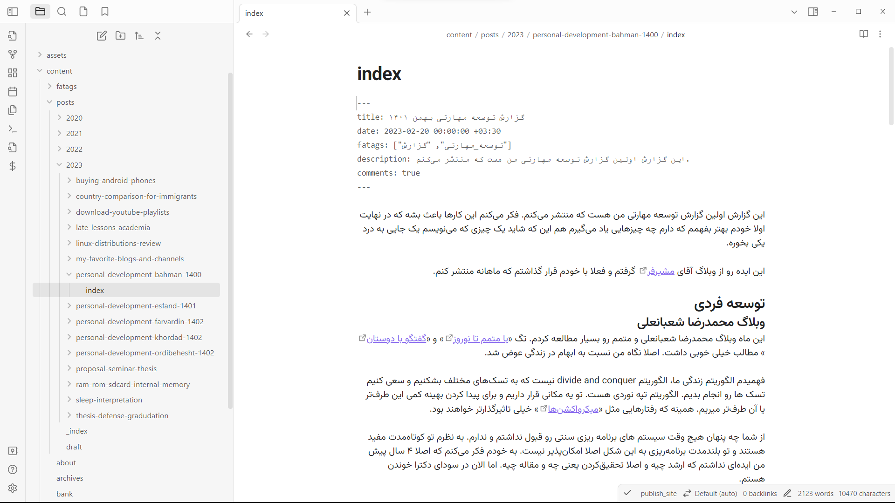
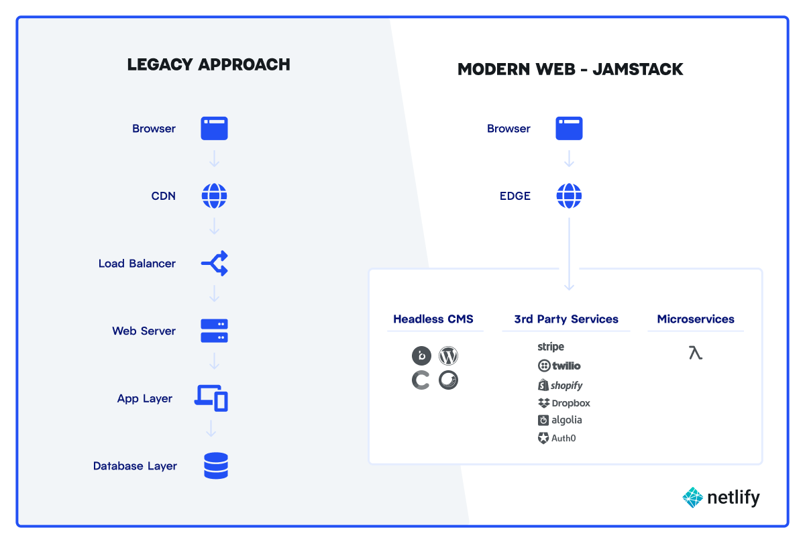
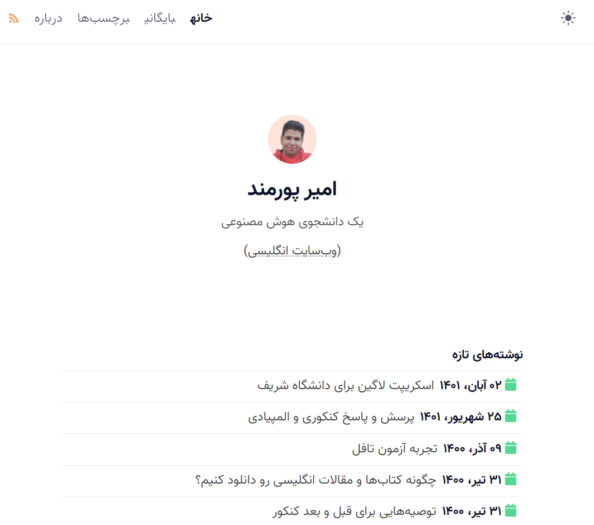
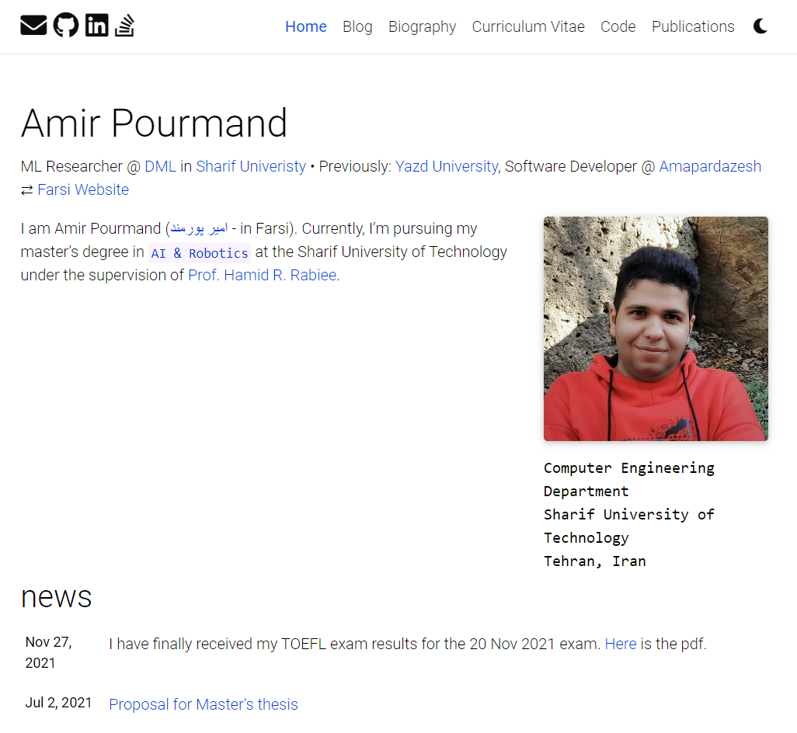

تا حالا چند نفر از دوستان بصورت حضوری یا مجازی ازم خواستند که بگم چطوری و با چه پلتفرمی سایتم رو درست کردم. دو تا از پیام‌ها رو اینجا می‌گذارم و سعی می‌کنم برای اون‌ها بنویسم. 

**پیام اول:**
> با سلام و احترام ،
 به قول چت جی پی تی امیدوارم که این ایمیل در بهترین حال و سلامتی به دست شما برسد. من ... هستم، دانشجوی ارشد عمران دانشگاه شهید بهشتی تهران و البته متولد سال 1367.
در جستجوی اطلاعات و منابعی در زمینه سمینار و پایان نامه بودم ، به لطف یکی از مقالات شما درباره سیمینار، با سایت شما آشنا شدم. علاوه بر بحث پست شما که بسیار کامل و مفید بود، سبب جذب من به سایت شما و مطالعه برخی مطالب وب سایت شما شد.
>از آنجایی که در زمینه برنامه نویسی تجربه کافی ندارم، اما دوست دارم وب سایتی مانند شما راه اندازی کنم، متوجه شدم که از سیستمی آزاد و البته با سرعت بالا استفاده میکنید بنابراین این خواستار راهنمایی شما هستم. آیا می توانید به من در این زمینه راهنمایی بفرمایید و اگر مقدور بود کدهای فارسی یا راستچین مورد استفاده در سایت خود را در اختیار بگذارید یا من را در راه اندازی وب سایتم راهنمایی کنید مثلا چه مشکلاتی دارد یا چه معایبی نسبت به ورد پرس؟

**پیام دوم:**
> این دومین وبلاگی‌ست که من می‌بینم به کمک github ساخته شده؛ لطفا در مطلبی درباره‌ی راه‌اندازی آن توضیح دهید. متاسفانه هر بار به بهانه‌ای دست‌وپا کردن وبلاگ را به تعویق انداخته‌ام. راهنمایی شما می‌تواند تسهیل‌گر باشد.

البته از قبل بگم که نوشتن مطلب فنی به زبان فارسی برام سخت هست. امیدوارم که بتونم به صورت قابل فهم مطلب رو برسونم. 

در این پست می‌خوام روشی که یکی دو ساله برای وبلاگ‌های خودم انجام میدم رو معرفی کنم. از وبلاگ‌ها منظورم [این وبلاگ](aprd.ir) و [وبلاگ انگلیسی‌ای](amirpourmand.ir) هست که دارم. 

این روش تقریباً هیچ هزینه‌ای نداره و بدون تمدید هاست و Backup و دردسرها مشابه کار رو راه می‌اندازه.

پیشنهاد من اینه که اگر وبلاگ شخصی می‌خواید، چیزهایی که تو این پست میگم رو انجام بدید و صرفا یک سایت ساده بالا بیارید. بعداً در پست بعدی به مواردی که برای سایت‌ مستحب هست خواهم پرداخت. 

## چرا وبلاگ استاتیک؟
اول باید به یک سؤال پاسخ بدم. چرا از سیستم‌هایی مثل ویرگول یا سیستم‌های قدیمی‌تر مثل بلاگفا استفاده نمی‌کنم؟

مهم‌ترین علتش اینه که وقتی من در پلتفرم‌های اجتماعی مثل ویرگول (یا حتی ایسنتاگرام و تلگرام) پست می‌گذارم، صاحب مطلب من نیستم؛ بلکه پلتفرم هست. هر زمان که تشخیص دادند که مطالبی که نوشتم‌، با اصول‌شون نمی‌خونه می‌تونند به سادگی حذف‌اش کنند و من هم حق اعتراض ندارم؛ چون از اول اصول‌ و قوانین‌شون رو پذیرفتم. 

در ضمن مشخصاً هر کدوم از این پلتفرم‌ها محدودیت‌های خاصی نسبت به وبلاگ شخصی دارند؛ مثلا تو ویرگول نمی‌شه فایل آپلود کرد. ادیتور متن‌اش خیلی کنده. در حدی که من جرئت نمی‌کنم پست‌های قدیمی‌ترم رو ویرایش کنم. 

خلاصه تو وبلاگ شخصی دست آدم بازه. می‌شه فایل گذاشت. می‌شه داخلش کدنویسی کرد. می‌شه لینک فیلم گذاشت. به شخصه چون وب‌سایت‌هام و محتواهاشون مال خودم هستند، حس بهتری نسبت بهشون دارم. 

اینجا سؤال دومی هم ممکنه پیش بیاد: چرا از سیستم‌هایی مانند وردپرس استفاده نمی‌کنم؟

سایت‌های وردپرسی نیاز به تهیه سرور و نگهداری اون دارند. شاید یکی از عللی که می‌بینم خیلی از وبلاگ‌های قدیمی که روی دامنه‌های شخصی بوجود اومدند، الان غیرفعال هستند، همین باشه. 

هزینه تمدید سالیانه، بک‌آپ‌گیری و پنل مدیریتی سخت و پیچیده، باعث شده که پلتفرم‌هایی بوجود بیان که سایت‌ رو خیلی ساده‌تر مدیریت می‌کنند. در واقع، وردپرس قابلیت‌های بسیار زیادی داره که هیچ‌کدوم به درد یه کاربر معمولی مثل من نمی‌خورند. من به پلتفرم‌ بسیار ساده‌تری نیاز دارم که نیازم رو مرتفع کنه.

خوشبختانه من اولین نفری نبودم که به این ایده رسیدم. افراد بسیار زیادی این ایده‌ به ذهن‌شون رسیده و چند سایت‌ساز با این ایده طراحی کردند. 

ایده این سایت‌سازها (مثل Jekyll و Hugo) اینه که بیایم مطالب وبلاگ رو داخل یک سری فایل متنی ساده بنویسیم، بعد این مطالب به یک وب‌سایت استاتیک تبدیل بشن و روی وب قرار بگیرند. 

به این سیستم‌ها Static Site Generator می‌گن که برای حل مشکلات Dynamic Site Generatorها مثل وردپرس و جوملا برای کاربردهای یک وبلاگ طراحی شده‌اند. این سایت‌ها دقیقاً به خاطر staticبودن‌شون بسیار سریع‌تر از وردپرس و امثالهم هستند. 

وقتی وب‌سایت استاتیک باشه، بسیاری از سرویس‌دهنده‌ها قبول می‌کنند که اون رو بصورت رایگان روی سرویس‌شون بگذارند. برای این کار من زمانی از Github Pages استفاده می‌کردم و از وقتی که دامنه ir تهیه کردم از Netlify و Cloudflare استفاده می‌کنم. Github و Netlify و Cloudflare سه سرویس‌دهنده مهم این نوع سایت‌ها هستند. 

البته شما می‌تونید **هر جایی** این سایت‌ها رو بالا بیارید؛ اما اگر بخواید رایگان باشه، این سرویس‌دهنده‌ها رو من قبلاً تست کردم و از عملکردشون هم راضیم. 

به این صورت شما یک‌بار کانفیگ‌هایی که لازمه رو انجام می‌دید، دیگه لازم نیست درگیر جزئیات هاستینگ و بک‌آپ و چه و چه بشید. صرفاً یک‌بار کانفیگ می‌کنید، ۵ سال یک‌بار هم پول دامنه رو می‌دید. به نظرم حتماً دامنه بخرید. هزینه ۵ ساله دامنه ir از قیمت یه عدد همبرگر هم کمتره. 

حتی نیازی نیست به مشکلات امنیتی هم فکر کنید. اصلاً من برای هیچ‌کدوم از وبلاگ‌هام سرور ندارم که بخوام نگران این باشم که هک بشه یا نشه. داون بشه یا نشه. بهش حمله بشه یا نشه. اصلاً چه کسی توان این رو داره که با غول‌هایی مثل Netlify و Cloudflare و Github دربیافته و بهشون حمله کنه. اینجا ما راجع به یه سرویس‌دهنده معمولی ایرانی صحبت نمی‌کنیم. راجع به کلودفر صحبت می‌کنیم که حجم مارکت‌اش برای CDN از آمازون و فیس‌بوک هم بزرگتره ([+](https://kinsta.com/cloudflare-market-share/)).

> البته به شخصه یک نگرانی برام وجود داره که Cloudflare یا Netlify به کل فیلتر بشن؛ ولی با توجه به این که بسیاری از استارت‌آپ‌ها و سایت‌های ایرانی از کلودفلر استفاده می‌کنند، فیلتر کردنش به این سادگی هم نیست و تبعات بسیار سنگین‌تری از یه وبلاگ شخصی داره. 

از وقتی که دارم از این سرویس‌ها استفاده می‌کنم، برام یک سؤال هم پیش اومده. چرا این سایت‌ها به من نوعی سرویس رایگان میدن؟

راستش تا چند وقت پیش فکر می‌کردم جوابش این باشه که وقتی من برای وبلاگ شخصی‌ام با تعداد کاربر کم از سرورهای اون‌ها استفاده می‌کنم، وقتی وبلاگم خیلی بزرگ شد و مثلاً لازم شد که ماهیانه به اندازه ۱۰۰۰ گیگابایت از وب‌سایتم استفاده بشه، اونوقت قطعاً حال و حوصله تعویض سرور رو نخواهم داشت و روی همین سرورها می‌مونم. کاری که Netlify انجام میده. 

ولی چند وقت پیش Cloudflare اومد و سرویس [Cloudflare Pages](https://pages.cloudflare.com/) رو معرفی کرد. سرویسی که برای هزاران وبلاگ شخصی کاملاً رایگان خواهد بود و از اینجا راستش من نمی‌فهمم چرا تعداد زیادی کمپانی به این نتیجه رسیدند که بهتره به بخش بزرگی از بازارشون همچین سرویس رایگانی رو بدن. 

## بخش‌های وبلاگ
این‌جا سؤالی که پیش میاد اینه که این سایت چطوری کار می‌کنه؟ 

سیستم‌هایی که برای سایت‌ها استفاده میشه این‌ها هستند:
- گیت‌هاب:‌ برای نگه‌داشتن سورس وب‌سایت، یعنی تم وب‌سایت به همراه پست‌ها و هر چیزی که داخل وب‌سایت نگه داشته میشه. پس وب‌سایت کلا داخل یک مخزن عمومی در گیت‌هاب موجود است. 
- سایت‌ هاستینگ: سایت Netlify - که میشه چند تا سایت Static رو همزمان داخلش بالا آورد. 
- سرور CDN (برای افزایش سرعت وب‌سایت): غول بزرگ، جناب Cloudflare - البته انجام این مورد کاملاً مستحب هست. 
- سیستم کامنت‌گذاری: Github Discussion یا Giscus
- نرم‌افزار برای پست نویسی لوکال: Obsidian - البته چون این سایت‌ها مبتنی بر markdown و بصورت متنی هستند، میشه تو تعداد زیادی از ویرایشگرهای مارک‌داون متن رو نوشت. ولی چون من نوت برداری روزانه‌ام داخل Obsidian هست، راحت‌ترم که با همین هم پست بگذارم. 

چیزی که راجع به این معماری دوست دارم اینه که این‌طوری بر شانه غول‌ها ایستاده‌ام. غول دنیای متن‌باز، گیت‌هاب، غول CDN دنیا Cloudflare. 

چون زیاد راجع به مارک‌داون و سادگی‌اش میگم، می‌تونید بعد از خوندن این پست ویدئو ۸ دقیقه‌ای زیر رو ببینید. همین ۸ دقیقه کافیه که تقریبا تمام قابلیت‌های مارک‌داون رو یاد بگیرید. این آقا ویدئوهای خیلی خوبی می‌سازه و اگر براتون بعداً سوال شد که چطوری میشه From Scratch یه تم مبتنی بر Hugo بسازید، بسیار کمک‌کننده خواهد بود. 

[Markdown Syntax | In One Video](https://www.youtube.com/watch?v=2JE66WFpaII)

## یک دمو از روال نوشتن پست
قبل از این که بخوام روش راه‌اندازی وبلاگ رو توضیح بدم، می‌خوام روال نوشتن یک پست (یا ویرایش پست‌های قبلیم) رو براتون توضیح بدم و بگم چطوری منتشرشون می‌کنم.

روش کلی اینه که من در نرم‌افزاری به نام Obsidian که برای نوت‌برداری هست، پست می‌نویسم. پست‌ها فایل متنی ساده با فرمت مارک‌داون هستند. بعد از همون داخل نرم‌افزار گزینه Commit و سپس Push رو می‌زنم و مطالب در داخل Github گذاشته می‌شن. 

سپس Github به سرور من (یعنی Netlify) اعلام می‌کنه که سایت آپدیت شده. Netlify سایت من رو از گیت‌هاب برمی‌داره و Build می‌کنه و سپس سایت جدید رو بالا میاره و تمام. 

چون همه چیز با Git و Obsidian انجام میشه. می‌تونم پست‌ها رو داخل موبایل هم بنویسم و آپدیت کنم و بعد از انجام Commit و Push سایت آپدیت خواهد شد. 

شاید نشون دادن یک عکس بهتر از هزار کلمه توضیحات باشه. به تصاویر زیر نگاه کنید که ببینید [Obsidian](https://obsidian.md/) چقدر نرم‌افزار گلی هست و نوشتن داخلش چقدر ساده است. 

راجع به Obsidian یک مطلب مستقل در [اینجا](https://aprd.ir/about-obsidian/) نوشتم و توضیحاتی دادم، پس دیگه بیشتر وقت‌تون رو نمی‌گیرم. 

## سایت‌های جم‌استک
اینجا شاید بد نباشه راجع به تفاوت‌های این مدل سایت‌ها (که با JamStack می‌شناسن‌شون) با وردپرس بیشتر توضیح بدم. منظور از JAMStack سایت‌هایی هست که با Java-script و API و Markdown نوشته می‌شن (یعنی Stackشون JAM هست). 

معماری این سایت‌ها با وردپرس و جوملا و بقیه علمای این حوزه تفاوت زیادی داره. عکس زیر از سایت Netlify این تفاوت رو به خوبی نشون میده ([+](https://www.netlify.com/blog/complete-guide-to-headless-cms/)). این سایت‌ها دیتابیس ندارند. لایه اپلیکیشن ندارند و به وب‌سرور اختصاصی نیاز ندارند. البته قطعاً برای بالا آوردن وب‌سایت نیاز به وب‌سرور داریم ولی هر وب‌سرور معمولی‌ای براشون کفایت می‌کنه. 

ایده کلی‌شون اینه که طراحی وب‌سایت با HTML CSS و javascript سخته. از طرفی مارک‌داون یه روش ساده برای بیان مطالب هست. بهتره مطالب سایت داخل مارک‌داون نوشته بشن و با یک تم پیش تعریف شده ترکیب بشن. بعد از اون موقع Build سایت، خروجی HTML و CSS و Javascript داشته باشیم. حالا هر سرویس‌دهنده‌ای می‌تونه HTML CSS ساده رو هاست کنه.

همون طور که متوجه شدید، بعضی سرویس‌دهنده‌ها مثل Netlify و Github نه تنها سایت رو هاست می‌کنند؛ بلکه خودشون بصورت اتوماتیک Build هم انجام میدن. پس تمرکز ما روی این‌ها خواهد بود. 

فکر کنم فعلاً برای مقدمه کافی باشه. بریم مراحل راه‌اندازی وب‌سایت رو به ترتیب بررسی کنیم:

## مرحله اول - انتخاب یک تم و سایت‌ساز
سایت [Jamstack](https://jamstack.org/generators/) یک لیست کامل از این سیستم‌های سایت‌ساز رو معرفی کرده. دو تا از معروف‌ترین‌هاشون Jekyll و Hugo هستند.

برای هر کدوم از این سایت‌ساز‌ها کلی تم وجود داره. حالا کاری که باید انجام بدید اینه که تم مورد نظرتون رو انتخاب کنید. [این سایت](https://jamstackthemes.dev/) کلی تم داره.  

### جکیل (Jekyll)
دو تم Jekyll رو من قبلا باهاشون کار می‌کردم که به نظرم مناسب بودند. 

#### تم سیمرغ
تم [سیمرغ](https://github.com/mhdzli/simorq) که آقای محمد زینعلی توسعه‌اش دادند. یک دمو از این تم رو می‌تونید [اینجا](https://www.zmim.ir/simorq/) ببینید. اون زمانی که من این تم رو داشتم به این شکل بود. 

#### تم al-folio
این تم بیشتر برای سایت‌های انگلیسی مناسب هست. خصوصاً برای افرادی که می‌خوان رزومه آکادمیک درست کنند و روی وب‌سایت بگذارند از قابلیت‌هاش لذت می‌برند. مثلاً میشه مقالات رو به فرمت bib بهش داد و خیلی قشنگ نمایش‌شون میده. همچین قسمت وبلاگ و بیوگرافی هم داره. 

صفحه [گیت‌هابش](https://github.com/alshedivat/al-folio) هم اگر نگاه کنید، بسیار فعال هست. برای راه‌اندازی اولیه وب‌سایت al-folio می‌تونید از [این آموزشی](https://amirpourmand.ir/posts/2022/al-folio-jekyll-website/) که اینجا نوشتم استفاده کنید. 

آموزشی که نوشتم برای وب‌سایت‌های مبتنی بر Jekyll مفید هست. سایت‌های مبتنی بر Jekyll رو میشه هم روی Github Pages و هم روی Netlify بالا آورد. 

سعی کردم خلاصه و مفید بنویسم. به نظرم میشه فهمید چطوری باید سایت رو راه بندازید ولی اگر متوجه نشدید بگید بیشتر توضیح بدم. 

## هوگو (Hugo)
می‌رسیم به جناب هوگو. من یکی دو سال هر دو تا سایتم رو با SSG (Static Site Generator) یا سایت‌ساز ایستای Jekyll درست می‌کردم. 

بعد از مدتی یک تم بسیار مینیمال و زیبا در Hugo پیدا کردم و کم کم جفتش رو به تم [Hugo-papermod ](https://github.com/adityatelange/hugo-PaperMod)منتقل کردم. الان هر دو وب‌سایت من تقریباً یک شکل هستند. 

خوبی هوگو اینه که ساختارش بسیار ساده‌تر هست و به همین دلیل فهم و کارکردن باهاش راحت‌تره. 

برای استفاده از هوگو اول هوگو رو نصب کنید. البته می‌تونید کلاً بدون نصب هوگو هم کار کنید ولی اون‌طوری باید کمی صبر کنید تا تغییرات از داخل گیت‌هاب‌تون روی وب‌سایت منتشر بشه و خلاصه ممکنه یکی دو دقیقه‌ای طول بکشه. راحت‌تر اینه که برای تغییرات اولیه و یادگیری هوگو رو نصب کنید. هوگو بسیار کم‌حجم هست و (بر خلاف بعضی سایت‌سازها) برای نصبش نیازی به بلدبودن انتگرال سه‌گانه ندارید. 

برای نصب هوگو می‌تونید از آموزش [وب‌سایتش](https://gohugo.io/installation/windows/) جلو برید یا این که مستقیما نسخه مدنظرتون رو از [اینجا](https://github.com/gohugoio/hugo/releases/latest) پیدا کنید و نصب کنید. فقط برای کار من نسخه معمولی هوگو هم کفایت می‌کنه و به Extended نیازی نیست. 

بعد که هوگو رو نصب کردید اگر می‌خواید یک وبلاگ فارسی داشته باشید می‌تونید [این ریپازیتوری](https://github.com/pourmand1376/hugo-papermod-farsi-template/) من رو Fork کنید و سپس روی سیستم خودتون Cloneاش کنید. 

در اینجا کافیه بدونید که پوشه content محل قرارگرفتن پست‌ها هست و فایل `config.yaml` برای تنظیمات اولیه وب‌سایت هست (چیزهایی مثل آدرس وب‌سایت و لینک‌های ارتباطی و این‌ها).

به نظرم در این قسمت با سعی و خطا و تغییر، سریع راه خودتون رو پیدا خواهید کرد. در ضمن می‌تونید با دستور `hugo serve` تغییرات وب‌سایت رو بصورت بی‌درنگ ببینید. 

الان که دارم می‌نویسم دارم فکر می‌کنم که احتمالاً برای این کار آموزش ویدئویی خیلی سریع‌تر و راحت‌تر خواهد بود. 

این مطلب ادامه دارد ... 
