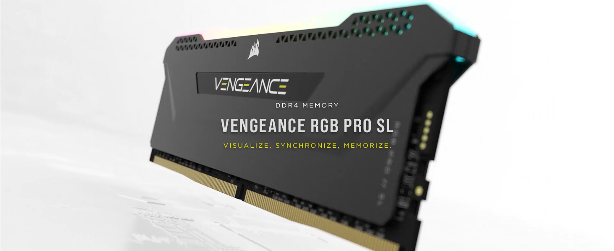
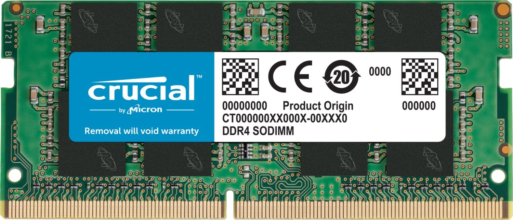
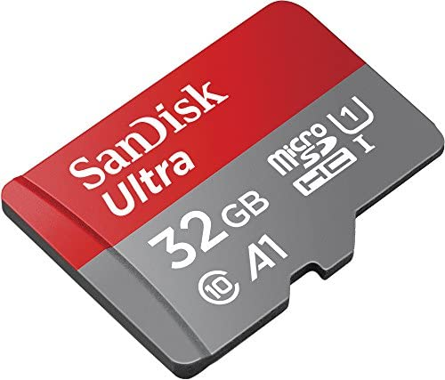

یک غلط فوق مصطلح در کشور ما وجود داره که منجر به سردرگمی ما هنگام خرید وسایلی مثل موبایل شده. مثلا وقتی می‌پرسم: «رم این گوشی چنده؟» و جواب می‌گیرم: «این گوشی تا ۱۲۸ گیگ رم ساپورت می‌کنه». دیدگاه من نسبت به رم با دیدگاه فروشنده نسبت به رم بسیار متفاوت هست. 

اتفاقا تو این مورد خاص این مورد بسیار مضر هم هست. لغت‌های فیلد کامیپوتر همگی یک تعریف استاندارد دارند که همه‌ جای دنیا پذیرفته‌ شده است ولی انگار بعضی از ما ایرانی‌ها دوست داریم زبان خودمون رو اختراع کنیم و با همون صحبت کنیم. 

اتفاقا به نظرم ساده‌سازی و مخفف‌سازی مفید هست. تو طول نوشته می‌بینید که مثل بقیه مردم، از گیگ به جای گیگابایت و از مگ به جای مگابایت استفاده می‌کنم و به نظرم اشکالی هم نداره چون وقتی میگم گیگ، همه می‌دونند من دارم از چی صحبت می‌کنم. همین که زبان مشترک داریم کافیه. 

> تقریبا چهار سال پیش بود که به پاساژ علاءالدین جهت خرید گوشی رفتیم و فروشنده جهت معرفی گوشی جلو اومد. گفت: «فلان گوشی رام (ROM) ۴ گیگ داره. حافظه گوشی ۶۴ گیگه و تا ۱۲۸ گیگ رم ساپورت می‌کنه». به نظرم با شنیدن این جمله تن آلن تورینگ بزرگ تو گور لرزید. شاید اگر زنده می‌بود با شنیدن این جملات دوباره خودکشی می‌کرد. 

جدای از شوخی. قصد دارم این سه تا واژه رو قدری شفاف‌تر توضیح بدم. 

### رم (RAM)
رم مخفف Random Access Memory هست. از قدیم‌الایام، حافظه‌های کامپیوتری رو باید بصورت ترتیبی (Sequential) می‌خوندند یعنی اصلا امکان خوندن‌شون بصورت تصادفی وجود نداشته. دسترسی تصادفی به این معنا هست که هر زمان خواستید یک قسمت حافظه رو انتخاب کنید و دیتای همون قسمت رو بخونید. برای مثال فلاپی، نوار کاسکت‌های قدیمی یا همین دیسک سخت (هارد خودمون) رو در نظر بگیرید. همه اینها از جنس حافظه با دسترسی ترتیبی هستند. 

ولی الان با پیشرفت تکنولوژی، پیدا کردن حافظه‌ای که تصادفی نباشه، سخت شده. اکثر حافظه‌هایی که داریم به این معنا، دارای دسترسی تصادفی هستند. حتی همین کارت‌حافظه‌ - که قراره راجع بهش روضه بخونم - هم با دسترسی تصادفی هست. پس کارت‌حافظه هم به نوعی رم حساب میشه. همون‌طور که خیلی از حافظه‌های دیگه رم حساب میشن. مثلا، تو SSD میشه اطلاعات رو بصورت تصادفی خوند ولی احیانا شما به SSD نمیگید رم. می‌گید؟

این معنایی که گفتم به یک عنوان معنای کلاسیک RAM بود. تو کتاب‌های معماری کامپیوتر بیشتر می‌تونید اینطور دسته‌بندی‌ رو مشاهده کنید. این معنایی نیست که من بخوام بهش بپردازم و تاکید داشته باشم. صرفا به عنوان تاریخچه مطرح کردم. کمتر جایی از این معنا استفاده می‌شه. 

اما تعریف متداول‌تر از رم (RAM)، حافظه‌ موقتی (نه دائمی) هست که سیستم‌عامل ازش استفاده می‌کنه. مثلا وقتی تو ویندوز برنامه‌ای رو باز می‌کنید، ابتدا کدهای برنامه از روی حافظه Disk یا SSDتون به RAM منتقل میشه، سپس سیستم‌عامل یه سری چک انجام میده و بعد از اون یکی یکی خط‌های برنامه - که داخل رم کپی شده - رو اجرا می‌کنه. مشابه همین فرآیند در اندروید، لینوکس و مک هم انجام میشه. 

شاید براتون سوال پیش بیاد که چرا سیستم‌عامل (مثل آدمیزاد) برنامه از روی Disk خط به خط اجرا نمی‌کنه؟ سوال خوبیه. قدیم‌ها اینکار رو می‌کرده ولی کم‌کم فهمیدن که حافظه‌های جانبی (مثل SSD و Hard Disk و غیره) خیلی کند هستند و حافظه‌های سریع‌تری جهت اینکار پیدا کردند. 

نام اون حافظه به شدت سریع‌ الان رم (RAM) هست. خود این رم انواع و اقسام سایز و سرعت داره. برای دستکاپ، فریم خیلی بزرگی داره. برای لپ‌تاب قدری کوچکتره و برای موبایل خیلی کوچیکه و خیلی وقت‌ها on-board عه. 

مثلا یه رم دستکاپ رو اینجا می‌تونید مشاهده کنید. 

[Corsair Vengeance RGB Pro SL 32GB (2x16GB) DDR4 3600 (PC4-28800) C18 1.35V Desktop Memory - White (CMH32GX4M2D3600C18W) at Amazon.com](https://www.amazon.com/Corsair-Vengeance-2x16GB-PC4-28800-Desktop/dp/B08SQRF8MJ)

یا مثلا یک رم لپ‌تابی این شکلی هست (قدری کوچکتره):

به نظر من، مهم‌ترین عامل تعیین‌کننده سرعت گوشی، رم اون گوشی هست. یعنی اگر بخوام یه فاکتور واحد در نظر بگیرم که سرعت گوشی‌ها رو بتونم مقایسه کنم، رم رو انتخاب می‌کنم. در این مورد مجزا خواهم نوشت. 

می‌تونید حدس بزنید با توجه به سرعت خیلی بالایی که حافظه رم داره، قیمت بسیار بالایی به ازای هر گیگ خواهد داشت. گوشی‌های موبایل امروزی معمولا ۴ تا ۸ گیگ رم دارند. رم لپ‌تاب هم الان معمولا بین ۸ تا ۱۶ گیگ هست. 

بنابراین تنها جایی که فعلا رم ۱۲۸ گیگ رو حتی ساپورت می‌کنه، کامپیوتر‌های سرور هستند (نه موبایل و حتی لپ‌تاب من و شما). قیمت همچین رمی اصلا کم نیست. 

### کارت‌حافظه (SD-Card)
کارت حافظه (یا مموری کارت یا کارت اس دی) یه نوع حافظه جانبی هست که دیتا رو ذخیره می‌کنه. از نظر تئوری، بود و نبودن حافظه‌های جانبی اهمیتی نداره. قرار نیست اگر موبایل یا لپ‌تابتون کارت‌حافظه نداشته باشه، روشن نشه ولی اگر RAM نداشته باشه روشن نمیشه! 

یه نمونه از کارت حافظه رو می‌تونید تو لینک زیر ببینید. 
[Amazon.com: SanDisk 128GB Extreme PRO SDXC UHS-I Memory Card - C10, U3, V30, 4K UHD, SD Card - SDSDXXD-128G-GN4IN](https://www.amazon.com/SanDisk-128GB-Extreme-UHS-I-Memory/dp/B09X7FXHVJ)

از نظر قیمتی اگر بخواید مقایسه کنید، یه عدد رم ۳۲ گیگ تقریبا ۱۰۰ دلار هزینه داره در حالی که کارت حافظه ۱۲۸ گیگ با ۲۰ دلار قابل خریده! تفاوت اصلی این دو حافظه اولا تو معماری برای طراحی شون هست و ثانیا توی سرعت‌شون. سرعت رم بسیار بسیار بالاتر از کارت اس دی هست. 

از طرفی پیدا‌کردن کارت‌حافظه ۱۲۸ گیگ و حتی ۵۱۲ گیگ کار سختی نیست و به شرطی که دستگاه‌تون ساپورت کنه می‌تونید بخرید و استفاده کنید. قاعدتا هم چیز گرونی نیست. تقریبا هم قیمت Hard External معادلش خواهد بود. 

با بررسی فروشگاهی مثل آمازون حتی یک مورد مشاهده نکردم که کارت حافظه و رم و مواردی مانند اینها جا‌به‌جا خورده باشه اما با کمال تاسف تو فروشگاهی اینترنتی مثل دیجی‌کالا کالاهای زیادی رو با نام‌های اشتباه مشاهده می‌کنید. 

### رام (ROM) و حافظه داخلی (Internal Storage)
رام در معنای کلاسیک‌ش همون Read-only memory هست یا حافظه فقط خواندنی. می‌تونید حدس بزنید که بعد از مدتی بعضی‌ها گفتند چرا فقط خوندنی باشه؟ یه کاریش بکنیم که بتونیم دوباره هم روش اطلاعات بنویسیم. اینجا بود که شکل‌ و فرم‌های مختلف دیگه‌ای از رام مثل EEPROM یا NVROM درست شد. 

EEPROM = electrically erasable programmable read-only memory

خلاصه‌ این که با این که هنوز اسمش رام هست و در تئوری باید فقط خوندنی باشه ولی مثل بقیه انواع حافظه هست. فقط مکانیزم خواندن و نوشتنش فرق داره. 

شاید براتون عجیب باشه که فلش(Flash)‌های خودمون در واقع نوعی حافظه رام هستند. تو ادبیات کلاسیک کامیپوتر، رام صرفا به همین معناست ولی تو ادبیات عام‌تر و امروزی‌تر رام معنای قدری متفاوتی رو به خودش گرفته. 

رام تو موبایل، به حافظه‌ای گفته میشه که فایل‌ و برنامه‌های سیستمی، اونجا قرار می‌گیرند. دسترسی به حافظه‌اش محدود هست و با روش‌های عادی نمیشه تغییرشون داد. 

در مقابل حافظه داخلی قرار داره که فایل‌ و برنامه‌های کاربر (مثل عکس و فیلم و داده نرم‌افزار‌ها) و اینطور مسائل روش قرار داره.

قدیم این دو تا روی دو چیپ مجزای سخت‌افزاری قرار داشتند. پس این عبارت که بگیم رام گوشی فلان قدر هست، معنی‌دار بوده ولی تو اکثر گوشی‌های جدید این دو تا حافظه روی یک چیپ سخت‌افزاری در کنار هم قرار دارند. البته مکانیزم‌هایی برای حفاظت از تغییر رام در گوشی‌ها تعبیه شده که نتونید هر چیزی خواستید روی گوشی بریزید که معمولا کسی که بخواد بلده چطوری دورشون بزنه. 

البته مرز بین این دو تا حافظه انقدر دقیق مشخص نیست تا حدی که بعضی‌ها میگن میشه این دو تا لغت رو interchangable استفاده کرد و بعضی میگن کاملا متفاوت اند. من به شخصه ترجیح میدم رام به به همون معنای کلاسیکش استفاده کنم و برای حافظه گوشی، از عبارت حافظه داخلی استفاده کنم که خیلی هم رایج هست. 

### حرف‌ نهایی
- رم، حافظه اصلی هر دستگاهی هست و به شدت تو عملکرد دستگاه تاثیر داره.
- حافظه‌داخلی و کارت‌حافظه، هر دو نوعی حافظه جانبی محسوب میشن که جز در موارد خاص (مثلا پر شدن)، سبب کندی یا افزایش سرعت نمیشن. 
- اینها با هم متفاوتند. 

تفاوت بین این حافظه‌ها از آسمون تا زمین هست. خیلی بده که یک تعریف من‌درآوردی از خودمون اختراع کنیم. بعد بصورت زنجیره‌وار معانی کلمات رو عوض کنیم (به مثال ابتدایی من دقت کنید). چه بهتره دنیا رو همونطوری توصیف کنیم که بقیه می‌کنند. اینطوری داخل یک قفس خودساخته اسیر نمیشیم. 

