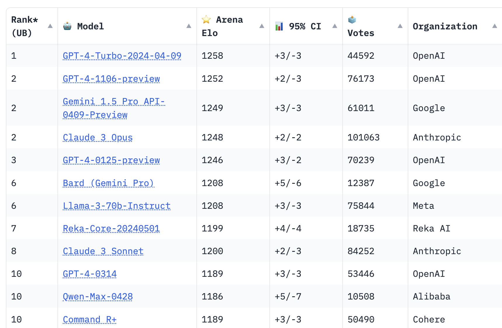

### خلاصه این قسمت
تو این قسمت می‌خوام راجع به نکاتی در مورد به کارگیری مدل‌های زبانی بزرگ وجود داره، صحبت کنم و تجربیات خودم و مقالات و وبلاگ‌هایی که تو این زمینه خوندم رو می‌گم. 

به نظرم این قسمت، قسمت خاصی هست چون حتی اگر نخواهید بدونید که مدل های زبانی چطوری درست شدند و چه آینده‌ای براشون متصور میشه، می‌تونید این قسمت رو بصورت مستقل گوش بدید. 

کاربردش هم از این نظر هست که هر کسی تو هر شغلی می‌تونه کاربردهایی از مدل‌های زبانی بزرگ برای خودش پیدا کنه و لازمه که بدونه چطوری با مدل‌ها کار کنه که بتونه مناسب‌ترین خروجی رو ازشون بگیره. 

اگر بخوام خلاصه کنم تو این قسمت کلاً راجع به Prompt Engineering صحبت کردم. 
### شنیدن اپیزود
همه اپیزودهای این پادکست تو کانال کست باکس منتشر میشه و البته می‌تونید از [جاهای دیگه](https://aprd.ir/podcast/) هم بشنوید. 

اینجا هم می‌تونید فایل صوتی این قسمت رو گوش بدید:

<iframe src="https://castbox.fm/app/castbox/player/id5618013/id706736204?v=8.22.11&autoplay=0" frameborder="0" width="100%" height="500"></iframe>

### تغییرات پادکست

از این قسمت می‌خوام روالی که پادکست ضبط می‌کنم رو کاملاً تغییر بدم. این تغییر از دو جهت هست. اولاً این که قبلاً چیزهایی که می‌گفتم صرفاً ایده‌های خودم بود ولی از الان یک سری منابع مثل پیپر و وبلاگ هم استفاده می‌کنم که تو مراجع بهش اشاره می‌کنم. 

دوماً می‌خوام به متن پررنگ‌تر بپردازم. به این صورت که اول متن هر اپیزود رو می‌نویسم و بعداً از روی متن، بصورت صوتی ضبط می‌کنم. این‌طوری متن و صوت دو تا موجود جداگونه هستند و با توجه به این که هنگام ضبط هم قرار نیست از روی متن روخوانی کنم، متن و پادکست ممکنه با هم متفاوت باشند. 

البته کلیت‌شون یکی هست ولی ممکنه هنگام ضبط یک مثالی چیزی یادم بیاد و بگم و حتی ممکنه بعد انتشار پادکست، یه سری چیزهای دیگه به ذهنم بیاد و بیام اینجا اضافه کنم. 

فعلاً این‌طوری پیش برم ببینم چی میشه. 

---
### متن پادکست
اول باید با این شروع کنیم که پرامت (Prompt) اصلاً چی هست؟ (پ خونده نمیشه). به یک معنا میشه Prompt رو ورودی مدل در نظر گرفت. ورودی‌ای که به شکل «دستور» به مدل می‌دیم و بدبخت باید اطاعت کنه. 

اگر با این مدل‌ها کار کرده باشید دیدید که معمولاً دو نوع Prompt مختلف داریم:
- Prompt سیستمی
- Prompt کاربر

(واقعیتش Prompt جواب مدل یا Prompt هوش مصنوعی هم هست ولی اون کاربردش متفاوته و بیشتر برای مکانیزم حافظه استفاده میشه که بعداً توضیح میدم و اینجا جاش نیست).

اوایل اصلاً این‌طور نبود. یک Prompt داشتیم به عنوان ورودی مدل، Prompt رو میدادی. جواب می‌گرفتی. بعداً که استفاده از این مدل‌ها باب شد. دیدند که برای کاربردهای تجاری بهتره یک Prompt سیستمی هم داشته باشیم. چون تو کاربرد تجاری «ورودی کاربر» رو هم به Prompt اضافه می‌کنیم. 

و اتفاقی که می‌افته اینه که کاربر می‌تونه اونجا هم دستورات خودش رو بنویسه! بعد مدل نمی‌دونه به دستور کی عمل کنه؟ چون عملاً همش متن هست و تفکیک خیلی مشخصی بین متن کاربر و متن سیستم وجود نداشت. این شد که الان Prompt سیستمی داریم. (البته قبلش هم یک سری روش‌ها برای تفکیک متن دستوری با متن کاربر وجود داشت اما بهتر بود از سمت خود کسی که LLM رو آموزش داده پیاده‌سازی بشه که بهترین جواب رو بگیریم).

ایده‌اش اینه که شما هر چی هم تو Prompt کاربر بگی که مخالف Prompt سیستم باشه، به Prompt سیستم توجه می‌کنه و به اون وزن خیلی بیشتری میده. 

برای کاربردهای عادی زیاد فرقی نداره. ولی کلاً بهتره که دستور رو داخل System Prompt بدید. بعد ورودی‌هاتون رو داخل User Prompt بدید. مثلاً می‌خواید بگید که این متن فلان مقاله است. ازش ۵ تا ایراد دربیار. 

بهتره که این دستور رو تو System Prompt بنویسید و متن مقاله رو تو User Prompt کپی کنید. 

خب Prompt رو تعریف کردیم. حالا باید راجع به Prompt Engineering صحبت کنیم.

خلاصه کنم Promptنویسی هنر اینه که چطوری به LLMها ورودی بدیم که بتونیم بهترین خروجی رو ازشون بگیریم. 

به نظرم لازمه اگر کسی این مدل‌ها به دردش می‌خوره برای یادگیری تکنیک‌های Prompt Engineering بگذاره. البته تو همین دو سال یک شغل جدید به نام مهندس پرامپت (Prompt Engineer) به لیست شغل‌ها اضافه شده که خیلی از شرکت‌ها آدمی رو با این عنوان استخدام دارند. 

ولی تو سطح غیرتخصصی هم میشه بهش فکر کرد؛ چون Prompt Engineer می‌خواد Promptی رو بنویسه که تو اپلیکیشن ازش استفاده بشه و کلی نکات ریز رو باید رعایت کنه. یعنی یک بار Prompt می‌نویسه و هزاران بار بسته به ورودی کاربر، Promptش به LLM داده میشه. 

ولی ممکنه شما بخواید برای کاربرد شخصی‌تون از LLM استفاده کنید و باز اینجا یه سری نکات به دردتون می‌خوره. نکاتش هم واقعاً ساده‌اند و بعد این که گفتم احتمالاً به خودتون می‌گید که چقدر بدیهیات رو به هم بافتم. 

فقط یک نکته رو قبلش بگم که هنوز در سطح تئوری ما چندان ایده‌ای نداریم که چرا فلان Prompt کار می‌کنه و چرا اون یکی Prompt کار نمی‌کنه. بیشتر این‌ حرف‌ها بصورت تجربی و عملی تو کاربردهای مختلف بدست اومده. یه بخشیش هم به نظرم به خاطر «حماقت» مدل‌های زبانی بزرگه و وقتی مدل‌ها در آینده «باهوش‌تر» بشن دیگه ممکنه به خیلی از این حرف‌ها نیازی نباشه. 

این چیزهایی که الان میگم بر اساس داک منابع معتبر مثل [OpenAI](https://platform.openai.com/docs/guides/prompt-engineering) هست. البته نظر شخصیم رو هم دخیل می‌کنم.
### استراتژی اول - واضح‌کردن خواسته
مدل نمی‌تونه ذهن‌خوانی کنه. خیلی ساده و منطقیه. اگر جواب طولانی می‌خواید، بهش بگید که طولانی جواب بده. اگر جواب یک خطی مدنظرتون هست، بهش دستور بدید. اگر لحن خاصی مدنظرتونه بهش بگید. خلاصه این‌طور نباشه که یک چیزهایی صرفاً تو ذهن‌تون باشه. 

کلاد یکی از مدل‌های معروف LLM هست. یک‌جا حرف قشنگی می‌زنه میگه که قانون طلایی نوشتن Prompt اینه که Prompt رو به دوستتون بدید و ازش بخواید جواب رو براتون بنویسه! اگر دوستتون هم گیج شد و نفهمید که باید دقیقاً چیکار کنه یا خروجی‌اش مطابق اون چیزی نبود که می‌خواستید، احتمالاً مدل زبانی هم نمی‌تونه. 

تاکتیک اول: برای این قضیه تا جایی که ممکنه بهش جزئیات بدید. مثلاً فرض کنید، متن یه جلسه رو دارید. می‌خواید خلاصه‌اش رو بدست بیارید. 

می‌تونید به مدل بگید که «متن این جلسه رو خلاصه کن» و مدل مجبوره حدس بزنه که منظور شما از خلاصه دقیقاً چی بوده. 

یا می‌تونید دقیق‌تر بگید که «متن جلسه رو در یک پاراگراف خلاصه کن. بعد لیست گویندگان رو بنویس و بگو که هر گوینده چه موارد مهمی رو گفته. بعد در نهایت هم حرف‌های گویندگان و پیشنهادات‌شون رو جمع‌بندی کن و بگو». میشه به سادگی فهمید که خروجی دومی بهتر خواهد بود. 

فکر هم نکنید که مثلاً جالب نیست که دستوری باهاش صحبت کنید. دستور بدید بهش. اصلاً بدبخت حافظه نداره که یادش بمونه که قبلاً بهش چی گفتید یا نگفتید. کلاً یه مدله. زیاد نمی‌خواد لطیف باهاش حرف بزنید. 

تاکتیک دوم: برای مدل پرسونا تعیین کنید یا حتی یک عنوان شغلی بهش بدید. مثلاً اگر برای یک کار حقوقی، به مدل بگید که «تو یک وکیل پایه‌ یک دادگستری هستی» نسبت به وقتی که هیچی نگید خروجی بهتری تولید می‌کنه. این واقعاً برای خودم هم عجیبه که چرا این اتفاق می‌افته. ولی به هر حال هست. 

تاکتیک سوم اینه که کار رو بهش مرحله مرحله بدیم و یه بار ازش نخواهیم. مثلاً ممکنه از مدل بخواید که متن رو خلاصه کنه و خلاصه‌اش رو به زبان فارسی بنویسه. 

این رو یه بار ازش نخواید. بهش بگید که «اول متن رو خلاصه کن و خروجی‌اش رو بنویس. بعد خروجی‌ای که نوشتی رو به فارسی ترجمه کن». دقت کنید. یک Prompt هست. چند تا Prompt نیست ولی مرحله مرحله داره. بهش می‌گیم مرحله مرحله خروجی‌هات رو تولید کن و تو هر مرحله از خروجی قبلیت استفاده کن. 

تاکتیک چهارم اینه که بهش مثال بدید. یعنی بهش بگید که این دو تا ورودی و خروجی منه که بصورت نمونه بهت میدم. تو هم طبق همین‌ها خروجی بده؛ یعنی دیگه دارید دقیقاً می‌گید که آقا به این مثال‌ها توجه کن.

اسم هم داره این. یعنی اگر بهش نمونه ندید و ازش چیزی بخواید اسمش Zero-Shot Prompting هست و اگر بهش نمونه بدید میشه Few-Shot. 

واقعاً برای خودمون هم همینه ها. یعنی ماها با مثال بهتر یاد می‌گیریم. یا بهتر بگم بدون مثال اصلاً یاد نمی‌گیریم. مدل هم همینه! 

تاکتیک پنجم هم برای شفاف‌تر شدن خواسته اینه که بهش متن مرجع بدید. مثلاً بهش میگید که «این سه صفحه متن رو بگیر و با توجه به این سه صفحه متن به سوال من جواب بده. از خودت چیزی تولید نکن. اگر هم چیزی داخل متن مرتبط نبود، بگو نتونستم با توجه به متن جواب‌تون رو پیدا کنم».

اینجا واقعیتش یاد تاریخ دبیرستان خودم می‌افتم. تو درس تاریخ معلم می‌گفت که راجع به فلان شخصیت تاریخی جواب بده. قاعدتاً کتاب باز هم نبود که بتونیم تو کتاب پیدا کنیم. شروع می‌کردم چیزهایی راجع به اون بدبخت می‌گفتم که روحش هم خبر نداشت. 

مدل هم همینه. حالا قسمت‌های بعد روش آموزش این مدل‌ها رو میگم و می‌بینیم که چرا این مدل‌ها توهم می‌زنند و می‌بافند. ولی بدبخت‌ها از این نظر هم مثل ما هستند. اگر بهشون بگیم که «از خودت چیزی تولید نکن و فقط با توجه به متن جواب بده. اگر هم نتونستی بگو نمی‌دونم». مدل تکلیفش مشخص میشه و اگر نمی‌شه جواب داد میگه نمی‌دونم. 

### استراتژی دوم - به مدل زمان بدیم
فرض کنید می‌خواید از مدل بپرسید که «آیا جواب فلان معادله ریاضی رادیکال ۳ هست یا نه». خب اگر همین سوال رو ازش بپرسید احتمال داره که جواب نادرستی بگیرید. چون مدل باید به یکباره یک معادله رو حل کنه و جواب بله یا خیر تولید کنه. 

روش بهتر اینه که بهش بگید که «اول با استفاده از روابط ریاضی، فلان معادله ریاضی رو حل کن و مرحله مرحله جواب‌ات و منطقش رو توضیح بده. بعد از اون خروجی جوابت رو با رادیکال ۳ مقایسه کن و بگو یکی هست یا نه». 

به این میگن روش «زنجیره افکار» یا Chain of thought.

این‌جوری جواب با اختلاف بهتری می‌گیرید. اینطوری انگار به مدل یک زمانی برای فکر کردن دادیم تا بتونه به جواب برسه و بعد جواب رو خروجی بده. خودمون هم همین‌طوری هستیم. به خیلی از سؤالات باید بشینیم فکر کنیم و خروجی رو روی کاغذ بنویسیم و با خودمون جلو بریم تا بتونیم براشون جواب مناسبی پیدا کنیم. 

یک روش دیگه هم اینه که به مدل بگیم که «آیا چیز دیگه‌ای هم هست که اضافه کنی؟ (سعی کن تکراری نباشه)». فرض کنید به مدل می‌گید که لیست اشتباهات یه Writing انگلیسی رو برام دربیار و ۵ تا اشتباه براتون لیست می‌کنه. اگر بهش مجدداً بگید که «آیا چیزی رو تو ننداختی؟» ممکنه که ۲ تا دیگه هم براتون اضافه کنه و واقعاً هم درست باشند. 

بعضی از این تکنیک‌ها هم به نظر موقت هستند. من دیدم که تو ردیت آدم‌ها رفتند تست کردند و دیدند که اگر ته خروجی به مدل بگی که «اگر این تسک رو خوب انجام بدی بهت ۲۰۰ دلار انعام میدم»، خروجی بهتر میشه :)) البته هیچ‌جا تو داکیومنت اصلی این‌طور پیشنهادی نمیدن و این بیشتر حالت غیررسمی داره. 

### استراتژی سوم - شکستن کار به وظایف کوچک‌تر

یکی از نکته‌های دیگه‌ای که خیلی مفیده. روش Prompt Chaining هست. 

این مدل‌ها هم تو خروجی و هم تو ورودی محدودیت دارند. نمی‌تونید بهشون بگید که برام کتاب بنویس! نهایتاً ۳۰۰۰ الی ۴۰۰۰ کلمه تولید می‌کنند (که تو هر مدلی فرق داره ولی حدوداً همینه). 

مثلاً یک کتاب هزار صفحه‌ای داریم که ۱۰ تا فصل داره و می‌خوایم خلاصه‌اش کنیم. این کتاب رو یهو نمی‌تونیم به LLM بدیم. حتی اگر ورودی‌اش انقدر قبول کنه، معمولاً بهش بگید به یک باره برام خلاصه کن، خروجی خوبی نمی‌گیرید. 

اینه که میایم مرحله مرحله می‌کنیم. اول به مدل می‌گیم که فصل یک کتاب رو بگیر و خلاصه کن. بعد به مدل می‌گیم که فصل دوم کتاب رو خلاصه کن. بعد می‌گیم فصل سوم رو خلاصه کن. الی آخر.

نهایتاً هم می‌تونیم بهش بگیم که خلاصه‌هایی که تولید کردی رو خلاصه کن! الان خروجی‌ای که میده خیلی جذاب‌تره. و حتی تک‌تک خروجی‌های میانی‌ای هم که میده جالب و قابل بررسی هست. 

این کار چند تا مزیت داره. اولاً کیفیت جواب‌های مدل خیلی بهتر میشه. دوماً خطایابی یا دیباگ‌کردن پروژه بسیار راحت‌تر میشه. چون دقیقاً مشخص میشه که کدوم قسمت مدل خطا داره و میشه روش کار کرد. 

خیلی وقت‌ها حتی میشه پرامپت‌های پیچیده‌تر رو هم به این شیوه بشکنیم و چندتاش کنیم و جدا جدا به مدل بدیم و ازش خروجی بگیریم.

من این کار رو چند وقت پیش برای یه سری فایل‌های صوتی آقای ملکیان انجام دادم و تو وبلاگم گذاشتم. با این که مدل تبدیل صوت به متنی که استفاده کرده بودم خیلی خوب نبود ولی باز خروجی‌ای که داده واقعاً قابل تأمله و به نظرم اگر خودم هم گوش می‌دادم و می‌نوشتم، خلاصه‌ام حدوداً همچین چیزی می‌شد. 

یک سری اوقات هم هست که وظیفه‌ای که می‌خوایم LLM انجام بده، پیچیده و سخته. مراحل داره و مراحلش هم ممکنه زیاد باشه. اگر دیدیم که مدل نمی‌تونه خوب عمل می‌کنه. می‌تونیم بشکنیم و جدا جدا بهش بدیم. اینجا هم این مورد می‌تونه کمک‌کننده باشه.

استفاده ترکیبی : قاعدتاً این تکنیک‌ها رو میشه ترکیبی هم استفاده کرد. هر جا دوست داشتید از ترکیب هر کدوم‌شون استفاده کنید که خروجی کامل رو بگیرید. 

### جمع‌بندی

خلاصه این که تو این قسمت سه تا استراتژی مهم برای Promptنویسی رو گفتم. استراتژی اول این بود که واضح از مدل درخواست کنیم. چند تا تکنیک هم داشت. جزئیات کافی بهش بدیم. پرسونا مشخص کنیم. مثال بهش بدیم. مرحله مرحله بخوایم جلو بره و شاید هم متن مرجع برای پاسخ به سؤال بهش بدیم. استراتژی دوم این بود که به مدل زمان برای فکر کردن بدیم و استراتژی سوم هم این که بعضی وقت‌ها بهتره تسک‌ها رو بشکنیم و برای هر تسک به مدل جدا ورودی بدیم و ازش خروجی بخوایم. 

امیدوارم که براتون جذاب و مفید بوده باشه. 

### منابع
- [A Systematic Survey of Prompt Engineering in Large Language Models: Techniques and Applications](https://arxiv.org/pdf/2402.07927v1)
- [OpenAI - Prompt Engineering Guide](https://platform.openai.com/docs/guides/prompt-engineering)
- [Anthropic - Prompt engineering Guide](https://docs.anthropic.com/claude/docs/prompt-engineering)
- [Meta - Prompting | How to Guide](https://llama.meta.com/docs/how-to-guides/prompting/)
- [Google - Prompt Engineering for Generative AI](https://developers.google.com/machine-learning/resources/prompt-eng)

علت این که از این آموزش‌ها استفاده می‌کنم اینه که بهترین LLMها موجود رو همین‌ها توسعه دادند و خب انتظار میره که کمی (حداقل کمی) از بقیه بهتر بدونند، چیکار کردند یا حداقل دستشون برای آزمایش‌های بیشتر روی مدل‌های خودشون بازتر بوده. 

پی‌نوشت: [اینجا](https://chat.lmsys.org/) هم جدول رتبه‌بندی LLMهای موجود رو نشون میده. (در ضمن تو همین سایت می‌تونید با جدیدترین نسخه LLMها چت کنید و عملکردشون رو رایگان بررسی کنید).

