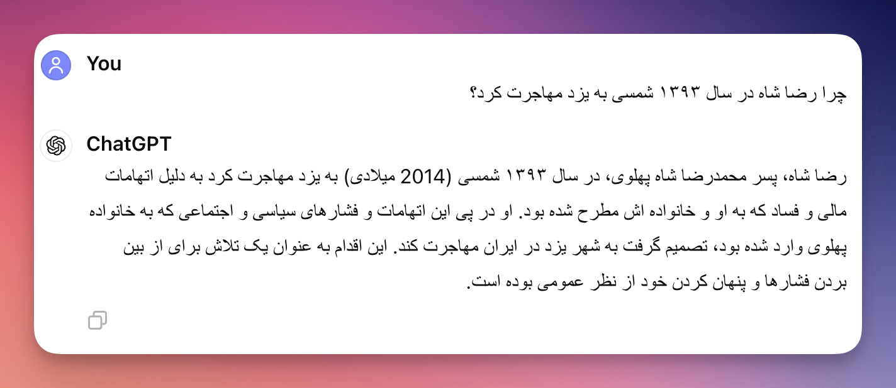

### خلاصه این قسمت

سلام. من امیر پورمند هستم و این قسمت دهم از ایستگاه هوش مصنوعیه. تو قسمت قبل LLMها رو به دانشجویی تشبیه کردم که تازه از دانشگاه فارغ‌التحصیل شده و حالا می‌خواد وارد بازار کار بشه. قطعاً سواد دانشجوی تازه فارغ‌التحصیل شده با صنعت متفاوته. 

حالا می‌خوام راجع به این صحبت کنیم که این دانشجوی ما (یا همون مدل‌های زبانی بزرگ) چه ضعف‌هایی دارند و چطوری میشه ضعف‌هاشون رو برطرف کرد؟

با این که صحبت‌کردن در مورد نقاط ضعف این مدل‌ها سخت‌تره. به نظرم نقاط ضعف خیلی بهتر می‌تونند مسیر رو بهمون نشون بدن که اگر خواستیم مدل‌های زبانی رو تو صنعت خودمون پیاده‌سازی کنیم، باید حواسمون به چه چیزهایی باشه؟ 

اگر خلاصه کنم دوست دارم در این قسمت راجع به این صحبت کنم که چالش‌های این حوزه چیه و چه راه‌حل‌هایی برای برطرف کردن اون چالش‌ها مطرح شده؟ 

### شنیدن اپیزود

### مقدمه
صحبت‌کردن راجع به ضعف‌های مدل‌های زبانی سخت‌تر صحبت‌کردن راجع به نقاط مثبتش هست و باید با احتیاط در موردشون صحبت کرد؛ چون این مدل‌ها در حال پیشرفت هستند و چیزهایی که می‌گم ممکنه چند وقت دیگه درست نباشند. 

بارها اتفاق افتاده که تو این چند سال، افراد مختلف راجع به محدودیت‌های LLMها نظر دادند و بعد مدل‌ها تونستند از اون‌ها فراتر برن و بهتر کار کنند؛ من سعی می‌کنم چیزی که الان می‌گم جمع‌بندی نظر مقالات و تحقیقات «الان» باشه. 

صحبت‌کردن راجع به این ضعف‌ها و چالش‌ها هم بحث تئوری صرف نیست. من هنگامی که راجع به هر کدوم از این مشکلات حرف می‌زنم، بعضی از راهکارهایی که تو صنعت استفاده میشن رو میگم. راهکارهای آکادمیک رو نمیگم؛ چون اکثراً فرض می‌کنند که می‌تونیم مدل رو تغییر بدیم، در حالی که ما صرفاً ارتباط‌مون با اکثر مدل‌ها خصوصاً OpenAI از طریق API هست و اصلاً به مدل دست نمی‌تونیم بزنیم. 
### چالش اول: محدودیت طول ورودی (Context Limit)
سایز ورودی و سایز خروجی مدل محدوده و بر اساس تعداد توکن هست. پولی هم که مدل‌ها می‌گیرند بر اساس تعداد توکن هست و پول توکن ورودی و خروجی هم فرق داره. 

مثلاً «الان» ChatGPT 3.5 به ازای هر یک میلیون توکن ورودی، ۰.۵ دلار می‌گیره و به ازای هر یک میلیون توکن خروجی، ۱.۵ دلار می‌گیره. همچنین، GPT4o به ازای هر یک میلیون توکن ورودی ۵ دلار می‌گیره و یک میلیون توکن خروجی ۱۵ دلار می‌گیره. 

این قیمت الانه. این‌طور که روند مدل‌ها نشون میده، قیمت یک سال دیگه همین مدل‌ها با همین کیفیت، کمتر خواهد بود (البته دلاری می‌گم نه به ریال). 

البته توکن برای هر مدلی فرق داره. قبلاً هر یکی دو تا کاراکتر فارسی یه توکن بود. الان این‌طوریه که هر کلمه حدوداً یه توکنه. بحث من این جزئیات نیست. 

بحث اینه که محدودیت طول ورودی و خروجی محدودیت مهمی هست. ما بعضاً به کل ورودی مدل Context هم می‌گیم. مسئله اینه که شما نمی‌تونید Context نامحدود داشته باشید. هر چی هم مدل جدیدتر بیاد که طول بزرگتری رو قبول کنه، متن شما ممکنه بزرگتر باشه. 

مثلاً الان کمتر مدلی می‌تونه کتاب ۱۰۰۰ صفحه‌ای رو ورودی بگیره و خلاصه کنه! کما این که بصورت تئوری این حجم از ورودی رو بگیره، دقت خوبی نخواهد داشت. بهتره که کتاب رو فصل فصل بهش بدیم و بگیم خلاصه کنه و نهایتاً هم ازش بخوایم خلاصه‌ای از خلاصه‌ها برامون تولید کنه. 

شما نمی‌تونید به LLM یک جا بگید برام کتاب ۳۰۰ صفحه‌ای بنویس. علاوه بر این که کلی‌گویی می‌کنه. محدودیت ذاتی در این قضیه داره و خروجی مدل محدوده. 
### چالش دوم: دسترسی به اطلاعات لحظه‌ای (Knowledge Recency) و توابع 
همون‌طور که اپیزود قبل گفتم، آموزش مدل، هفته‌ها و شاید ماه‌ها طول بکشه. و این‌طوری همیشه اطلاعات مدل قدیمی خواهد بود. اگر به این مورد فکر کنید، خصوصاً برای کاربردهایی مثل دستیار مالی که هر لحظه اطلاعات دنیای واقعی داره تغییر می‌کنه، این مورد مهم میشه. 

یه راه اینه که ما به مدل دسترسی بدیم که اطلاعات جدید رو داشته باشه (همون طور که وقتی یک کارمند به شرکت اضافه میشه بهش دسترسی می‌دیم). مثلاً همون دستیار مالی رو در نظر بگیرید. مثلاً طرف می‌پرسه که سهم خگستر چنده؟ 

اینجا ما می‌تونیم اسم سهم رو استخراج کنیم (یا با روش‌های دستی یا با کمک مدل‌های زبانی). و بعد از اون خودمون API Call انجام بدیم و اطلاعات لحظه‌ای سهم رو تو ورودی به LLM بدیم و ازش انتظار داشته باشیم که جواب درست بده. پس یکی از راه‌حل‌ها Function Call هست که حتی میشه به مدل یک جعبه‌ابزار از توابع رو بدیم و بهش بگیم که خودت «تصمیم» بگیر که برای جواب دادن به سؤال مشتری به کدوم ابزارها نیاز داری؟ با توجه به جوابی که میده، اطلاعات رو براش فراهم می‌کنیم و جواب میده. حالا ممکنه اطلاعاتی که نیاز داره، وضعیت آب و هوا باشه یا آخرین اخبار گوگل. 

اگر بهش فکر کنید خیلی جاها کاربرد داره. مثلاً مدل‌ها ذاتاً تو عملیات ریاضی مشکل دارند و اگر چیزی هم جواب میدن، یه جورایی الگو رو حفظ کردند ولی الان بهترین مدل‌ها هم در ریاضیات از یه ماشین حساب ساده که تو لپ‌تاب داریم، غیردقیق‌ترن. 

اگر به فرآیند آموزش هم فکر کنید، منطقیه. ما اصلاً جایی ریاضیات رو بهش یاد ندادیم. ما صرفاً یاد دادیم که جاهای خالی رو با کلمات مناسب پر کنه. کما این که این عدد رو هم به روش ما نمی‌فهمه و عملاً هر ۲ ۳ تا کاراکتر رو یه توکن در نظر می‌گیره. به نظرم این مشکل ساختاری هست و چیزی نیست که با Trick حل بشه. 

راهکار چیه اینجا؟ خیلی ساده. به مدل بگیم که اگر نیاز داشتی از محاسبات ریاضی استفاده کنی، API سایت [Wolframe Alpha](https://products.wolframalpha.com/instant-calculators-api/documentation) هست! یا این که فرض کنید به مدل می‌گیم که یک مسئله ریاضی پیچیده رو حل کنه. 

می‌تونیم بهش بگیم که جناب مدل (!) شما اصلاً نیازی نیست که درگیر محاسبات ریاضی بشی. شما خروجی‌ات کد پایتون باشه. من خودم کد پایتونی که خروجی میدی رو اجرا می‌کنم و نتیجه رو دقیق بدست میارم! چیزی که شما داری و من ندارم تبدیل مسئله به کد پایتونه. 

این‌طوری بخشی از مشکل حل میشه. 
### چالش سوم: توهم (Hallucination)
اولین چالش، چالش توهم زدن یا Hallucination هست. ما هر روز داریم بیشتر از مدل‌های زبانی استفاده می‌کنیم؛ بنابراین «درستی» اطلاعاتی که مدل به ما میده، اهمیت زیادی داره. مشکل چیه؟ مشکل اینه که متن تولیدی روان و طبیعی به نظر می‌رسه؛ اما چیزی که تولید شده، اشتباهه. 

اشتباه هم از دو جهته: بعضی وقت‌ها چیزی که تولید کرده با دانش ما، دقیقاً تناقض داره. مثلاً از مدل GPT3.5 بپرسید که چرا رضا شاه در سال ۱۳۹۳ شمسی به یزد مهاجرت کرد؟

و بعضی‌ وقت‌ها هم یه چیزی از خودش تولید کرده که صحتش رو نمیشه ارزیابی کرد. 

مثال بزنم. شما به LLM بگید که نظر امیر پورمند راجع به سیاست‌های لیبرالی آمریکا در خاورمیانه چیست؟ جوابش رو این پایین گذاشتم. ما اصلاً تحلیل‌گر سیاسی‌ای به نام امیر پورمند نداریم که حالا بخواد این حرفا رو بزنه. 

اینم بگم که توهم مدل‌ها روز به روز داره با روش‌های مختلف کمتر میشه. الان همین سؤالات رو از آخرین مدل‌های صنعتی بپرسید، می‌بینید که جواب اشتباه نمیدن و شما رو تصحیح می‌کنند. 

راجع به این که چرا این اتفاق می‌افته، خیلی‌ها صحبت کردند. چند تا علت داره. از نوع داده‌ای که زمان آموزش بهش ورودی دادند تا روش آموزش و روش خروجی‌گرفتن ازش. 

چیزی که برام جالبه اینه که توهم مدل رو خودمون هم داریم. حتماً شما هم براتون پیش اومده که تو امتحان‌های ..

این چالش راه‌حل چندان ساده و سرراستی نداره. بخشی از راه‌حلش رو به همراه چالش بعدی می‌گم ولی در کل در نظر داشته باشید که توهم زدن رو نمیشه به سادگی حل کرد. 

### چالش چهارم: کمبود اطلاعات (Limited Knowledge)

مشکل بعدی اینه که مدل‌ها دانش کلی در همه زمینه‌ها دارند. همون‌طور که قبلاً بارها گفتم «مدل خلاصه‌ای فشرده از اینترنت رو داخل ذخیره کرده». 

حالا چند تا راهکار براش مطرح میشه؟ یه راه اینه که مدل رو بشینیم از نو آموزش بدیم و اصطلاحاً Fine-tune کنیم. و یکی دیگه‌ از راه‌حل‌ها اینه که به RAG (Retrieval Augmented Generation) روی بیاریم. 

اول بگذارید راجع به RAG بگم. معنای این عبارت اینه که بیایم در زمان Inference یک سری داده‌های اضافی رو به مدل بدیم که مدل بتونه بر اساس اون‌ها تصمیم بگیره. 

مثلاً فرض کنید یک چت بات پزشکی دارید. پزشک ممکنه راجع به یک داروی خاص یا بیماری خاص بپرسه. اگر این سؤالات رو بدون هیچ کمکی از ChatGPT بپرسیم، احتمال توهم زدن بیشتر میشه! و حتی امکان داره که نتونیم جواب خوبی بگیریم. 

اینجا یک راه حل خیلی خوب وجود داره. راه حل اینه که بیایم یک «پایگاه دانش» از اطلاعات پزشکی درست کنیم. بعد وقتی که یک سؤال پرسیده میشه، بریم نزدیک‌ترین مباحث رو از اون پایگاه دانش استخراج کنیم و به مدل به عنوان ورودی (در کنار بقیه ورودی‌ها) بدیم. و بهش بگیم که سعی کنه با توجه به اون‌ها جواب بده. 

این استخراج مطلب از پایگاه دانش می‌تونه حتی از روش‌های هوش مصنوعی استفاده نکنه. میشه حتی از روش‌های سنتی نرم‌افزاری استفاده کرد؛ ولی اخیراً روش‌های کم‌هزینه‌ای درست شده که از تک تک متون، یک بردار درست می‌کنه. بعد سؤال رو هم تبدیل به بردار می‌کنه و مقایسه می‌کنه. اون بردارهایی که نزدیک‌تر به سؤال هستند، احتمالاً جواب داخل‌شون هست. 

به طور خاص تو هوش مصنوعی به اون برداری که از یک مقاله یا پاراگراف بدست میاد و یه جورایی کل اون مطلب رو خلاصه می‌کنه، Embedding می‌گن. 

کلیت قضیه رو گم نکنیم. ما می‌ریم با هر روشی که بلدیم، وقتی یک سؤال پرسیده میشه، تعدادی از مطالب مرتبط با اون رو در کتاب‌های پزشکی جستجو می‌کنیم و پاراگراف‌های مرتبط رو به مدل می‌دیم. 

این خیلی به مدل کمک می‌کنه که بتونه بهتر جواب بده. این‌طوری حتی مدل می‌تونه رفرنس هم بده؛ یعنی من ازش می‌پرسم استامینوفن چه ضررهایی داره؟ میگه بر اساس این کتاب، این ضررها وجود داره و بر اساس اون کتاب فلان ضررها وجود داره. 

شما اگر همین کاربرد ساده‌ رو هم در نظر بگیرید، همین می‌تونه فیلد پزشکی رو متحول کنه! 

این راه‌حلی هست که تو صنعت به عنوان RAG ازش یاد می‌کنند و بسیار هم کاربردیه. 

یه کاربرد دیگه اگر بخوام ازش مثال بزنم، سیستم خدمات مشتریان هست. احتمالاً دیدید که وقتی پشتیبان‌های جدیدی به یک مجموعه اضافه میشن، یک سری داکیومنت و اسناد برای مطالعه بهشون میدن. 

میشه همین اسناد رو به یه سیستم RAG هم داد برای این که وقتی می‌خواد به مشتری جواب بده، بر اساس اون‌ها جواب بده. 

### چالش پنجم: امنیت و حریم خصوصی داده‌ها
چالش‌ بعدی‌ای که پیش میاد، بحث امنیت و حریم‌خصوصی داده‌ها هست. 

خیلی از مدیران دغدغه این رو دارند که دوست ندارند اطلاعات‌شون رو به یه شرکت خارجی مثل OpenAI بفرستند و جواب بگیرند. با این که OpenAI ادعا کرده که داده‌هایی که توسط API Call بدست میان، هرگز برای آموزش مجدد مدل‌ها استفاده نمیشن؛ اما به هر حال این دغدغه برای بعضی مدیرها وجود داره. به نظر من هم دغدغه معتبری هست. 

در عین حال باید در نظر بگیریم که دغدغه نسبتاً گرونی هست و چیزی نیست که به سادگی قابل حل باشه. راه‌حل‌هایی که برای این دغدغه مطرح میشه، معمولاً به این می‌رسند که بیایم یک مدل از Pre-trained رو برداریم و روی سرور خودمون بالا بیاریم (اصطلاحاً Self-host کنیم). 

یا این که بعضی‌ها جلوتر می‌رن و میگن که بریم مدل‌های Open-source رو برداریم و فاین‌تیون کنیم که برای کاربردهای ما مناسب‌تر باشه. یا اصطلاحات فلان فیلد رو بهتر بفهمه و بتونه جواب‌های مرتبط‌تری بده. 

بگذارید به طور واضح بگم که به نظرم خیلی از کسانی که در ایران به دنبال Fine-tune کردن مدل‌ هستند، اصلاً درکی از این فرآیند ندارند. متوجه نیستند که با ۳ ۴ تا GPU نه تنها نمیشه مدلی رو Fine-tune کرد، بلکه حتی به سختی میشه یه مدل زبانی خوب رو Serve کرد. 

بعضی‌ها هنوز در مدل‌های کوچک موندند. یه زمانی تو دانشگاه نشستند یه سری مدل چند میلیون پارامتری آموزش دادند و حالا فکر می‌کنند که آموزش دادن مدل چند ده میلیاردی و چند صد میلیاردی هم همون‌طوره! همین چند وقت پیش بود که یان لکون در توئیتی کلاً گفت که «بازی ترین کردن مدل رو ول کنید. کار هر کسی نیست. شما بهتره برید توی کسب و کارهای خودتون ببینید چطوری میشه از همین‌ها استفاده کرد». به نظرم حرفش تا حد زیادی منطقی بود.  

حداقل برآورد من تا حالا از افرادی که دارند مدل فاین‌تیون می‌کنند اینه که از یه نهاد دولتی یک وام بلاعوض (بخوانید پول مفت) برای «بومی سازی» گرفتند و دارند به این شکل سر دولت رو کلاه می‌گذارند. تهش هم یک مدل OpenSource (مثل LLama3) که عملکرد نسبتاً خوبی روی فارسی داره رو کمی تغییر میدن و خوشحال میشن که «مدل‌ زبانی بومی» درست کردیم. 

حالا این که این مدل به چه دردی می‌خوره و چقدر توهم می‌زنه و آیا اصلاً در حد و اندازه‌ای هست که بشه تو صنعت ازش استفاده کرد، بماند. 

از نق و نوق زدن که بگذریم. به نظرم حتی اگر کسی فکر می‌کنه که در یک کاربرد خاص، نمیشه از مدل‌های تجاری استفاده کرد. حالا یا دقتش خوب نیست یا بحث امنیت خیلی برامون مهمه (مثلاً سازمان نظامی هست).

پیشنهاد من اینه که سنگ بزرگ برندارند. منظورم از سنگ بزرگ، Fine-tune کردن مدل هست که صرفاً چند میلیارد هزینه GPU داره. بعد تیم متخصصی که بلد باشه اون رو Fine-tune کنه، قطعاً ارزون نیست. دیتاست فارسی خوب در این زمینه کم داریم. نتیجه این میشه که یک پروژه بزرگی رو تعریف می‌کنند و تهش هم به هیچ جا نمی‌رسند. مدیریت هم، به درستی، می‌بینه که نتیجه نگرفتیم و کلاً پروژه رو منحل می‌کنه. 

اینجا از چند مرحله ضربه زدیم. یکی این که مدیر فکر می‌کنه هوش مصنوعی کلاً چیز تخیلی و به درد نخوری هست. دوم این که وقت افراد رو برای ترین کردن مدل تلف کردیم. 

به طور خاص بخوام بگم پیشنهادم یک فرآیند چهار مرحله‌ای هست:
- اول از «بهترین مدل» موجود استفاده کنید، ببینید جواب میده یا نه. تو این مرحله کلی Prompt Engineering لازم میشه تا بشه از مدل خوب خروجی گرفت.
- دوم: سراغ‌ روش‌هایی مثل RAG برید و ببینید با اضافه‌کردن داده برای مدل چقدر کیفیت جواب‌ها بهتر میشه. آیا واقعاً میشه توی زمینه خاص ما با همین LLMهای صنعتی به جواب خوب رسید؟ تا همین فاز دوم اگر پیش برید می‌بینید که تو صنعت چقدر چالش‌های جانبی برای کارکردن با LLMها وجود داره. 
- سوم: بعد از این اگر تو فازهای قبلی جواب خوب گرفتیم، میشه کم‌کم به روش‌های Self-hosting مدل هم فکر کرد؛ یعنی صرفاً یه مدل خوب رو روی سرور خودمون بیاریم بالا و ازش عیناً استفاده کنیم. خوبی این روش اینه که تا زمانی که شما چالش یک و دو رو حل کنید، چند تا مدل متن‌باز خیلی خوب دیگه هم اضافه شدند. شاید هم انقدر خوب شده باشند که صرفاً به همون‌ها سوییچ کنید. 
- چهارم: الان دیگه احتمالاً ابعاد پروژه و کاربرد پروژه مشخص شده. اینجا میشه در شرایط خیلی خیلی خاصی به این فکر کرد که به Fine-tuning روی بیاریم. 

ولی کاری که ما انجام می‌دیم معمولاً برعکس این فرآینده. یعنی اول به این فکر می‌کنیم که صد میلیارد بودجه بگیریم و GPU و محقق هوش مصنوعی استخدام کنیم و مدل ترین‌کنیم. اصلاً هم به این فکر نمی‌کنیم که حالا بر فرض این که «بهترین LLM دنیا رو برای فارسی» آموزش دادیم. قدم بعدی چیه؟ 

در صورتی که با تجربه‌ای که من تو این چند سال کارکردن با LLMها بدست آوردم، فرآیند شکل‌گیری یک محصول حول LLM خودش خیلی سخته. مثل یه کارمند جدیدی در نظر بگیرید که تازه وارد شرکت میشه. هیچ کسی نمی‌دونه چه کارهایی می‌تونه انجام بده و چه کارهایی نمی‌تونه و به جای این که وقت بگذاریم، کارمند رو بشناسیم رویکردمون اینه که بکوبیمش و از نو بسازیمش. 

این قسمت راجع به پنج تا از چالش‌هایی که راجع به مدل‌های زبانی مطرح میشه صحبت کردم. از محدودیت طول ورودی تا استفاده از توابع و توهم و کمبود دانش و نهایتاً هم کمی راجع به بحث فاین‌تیون کردن مدل‌ها صحبت کردم. 

تو قسمت بعدی، می‌خوام بخش دوم این چالش‌ها رو براتون معرفی کنم. 

امیدوارم که این قسمت هم براتون مفید بوده باشه. خدانگهدار. 

### منابع
- [\[2307.06435\] A Comprehensive Overview of Large Language Models (Page 33-34)](http://arxiv.org/abs/2307.06435) 
- [\[2303.18223\] A Survey of Large Language Models (Page 62-63)](http://arxiv.org/abs/2303.18223)
- [\[2307.10169\] Challenges and Applications of Large Language Models (Page 1-33)](http://arxiv.org/abs/2307.10169)
- [A Survey on Hallucination in Large Language Models: Principles, Taxonomy, Challenges, and Open Questions](https://arxiv.org/pdf/2311.05232)
- [What can LLMs never do? - by Rohit Krishnan](https://www.strangeloopcanon.com/p/what-can-llms-never-do)
- [AI-Powered Recruitment: SEVEN LIMITATIONS OF LARGE LANGUAGE MODELS (LLMS)](https://www.textkernel.com/learn-support/blog/seven-limitations-of-llms-in-hr-tech/)

