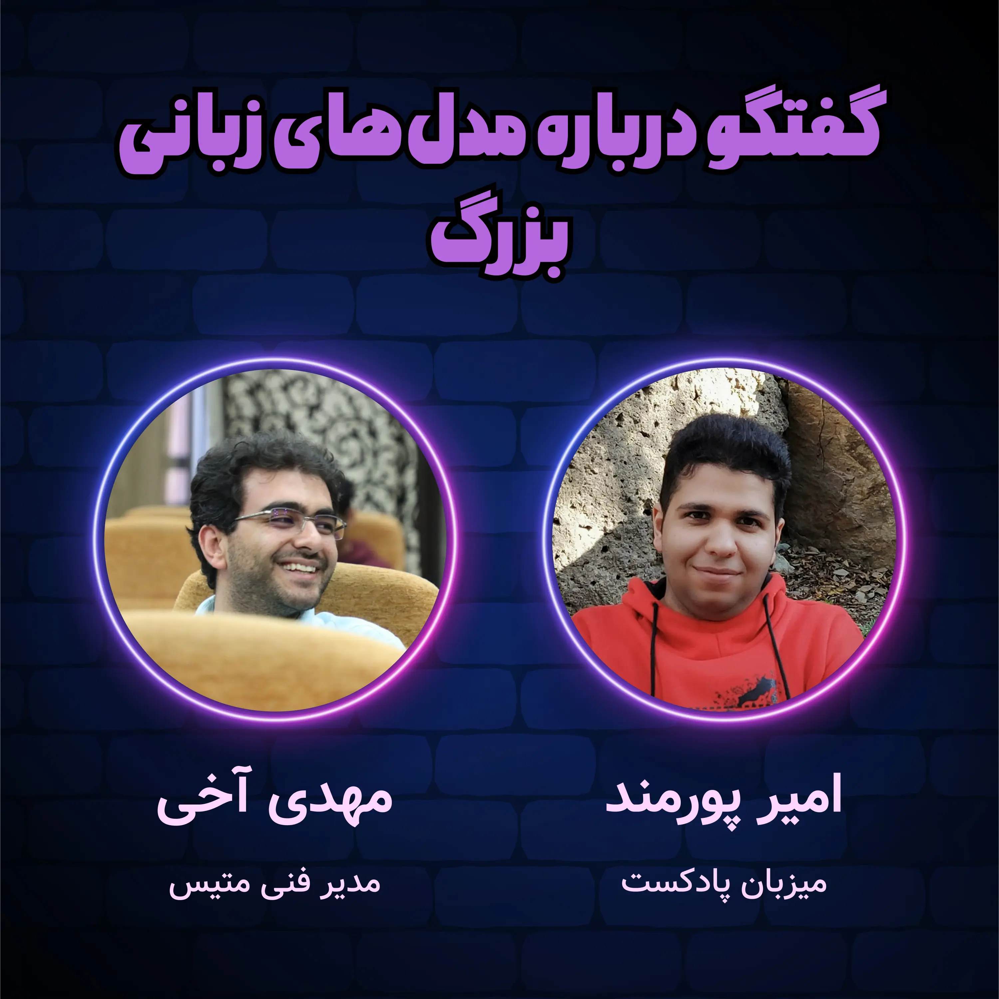

### خلاصه این قسمت

در این قسمت با مهدی آخی راجع به مدل‌های زبانی بزرگ، صحبت کردم. بحث رو از سابقه مهدی شروع کردیم و کم‌کم راجع به کاربردهای مختلف هوش مصنوعی و به خصوص مدل‌های زبانی بزرگ صحبت کردیم و به بیکار شدن آدم‌ها هم رسیدیم. کمی هم راجع به چالش‌های واقعی کار کردن با این مدل‌ها در صنعت صحبت کردیم و نهایتاً هم مهدی پیشنهادهایی برای ساخت مرحله مرحله محصول با این مدل‌ها میده و بحث رو جمع می‌کنیم. 

این قسمت بصورت تصویری ضبط شده و در یوتیوب هم آپلود شده. اگر دوست دارید بصورت تصویری مشاهده کنید، می‌تونید از اینجا ببینید. 

### زمان‌بندی ویدئو
 از این بخش می‌تونید زمان‌بندی ویدئو رو ببینید. 

- 00:00:00 معرفی و سابقه
- 00:09:49 معرفی GenAI
- 00:15:48 معرفی سامانه متیس
- 00:25:10 کاربردهای عمومی مدل‌‌ها
- 00:41:10 کاربرد مدل‌ها در آموزش
- 00:50:37 کاربرد مدل‌ها در پزشکی 
- 00:56:55 بیکارشدن آدم‌ها 
- 01:09:10 چالش‌های ذاتی مدل‌ها 
- 01:47:44 فاین‌تیون‌ کردن مدل‌ها 
- 02:04:35 ساخت محصول با مدل‌های زبانی
- 02:18:34 حرف‌های باقیمانده

### تماشای گفتگو در یوتیوب
این قسمت بصورت ویدئویی هم ضبط شده و در کانال یوتیوب من هم آپلود شده. اگر با اینترنت آزاد (!) این صفحه رو ببینید، می‌تونید همین‌جا هم مصاحبه رو بصورت تصویری  ببینید. 



### شنیدن اپیزود



<iframe src="https://castbox.fm/app/castbox/player/id5618013/id718766122?v=8.22.11&autoplay=0" frameborder="0" width="100%" height="500"></iframe>
