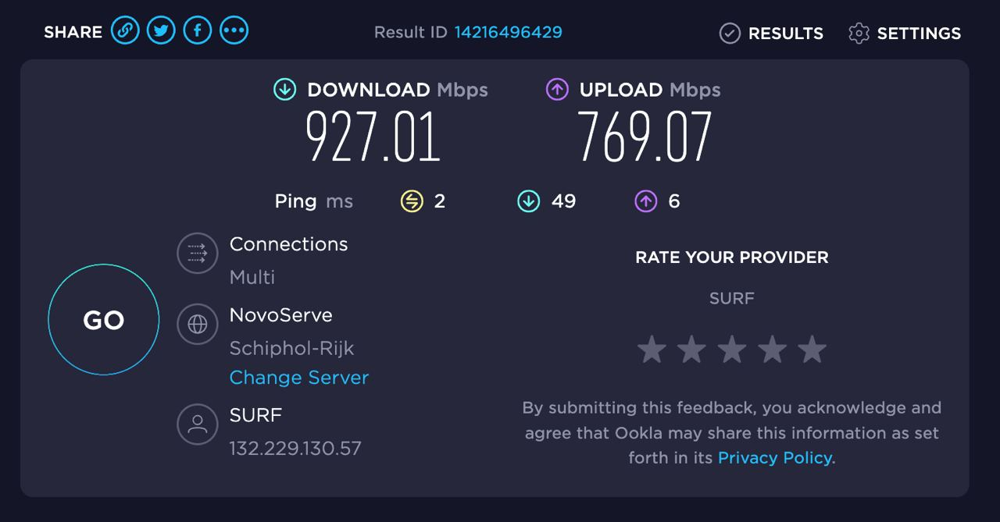

شاید قدیم، اینترنت یه چیز لوکس تلقی میشد و به درد کار مهمی هم نمی‌خورد ولی الان کمتر کسی اهمیتش رو منکر می‌شه. از طرفی دیدم که خیلی‌ها به علت ناآشنایی با سرویس‌ها و خدماتی که می‌تونند دریافت کنند، اینترنت مناسبی ندارند و اذیت میشن. این بود که گفتم تجربه خودم رو تو این زمینه به اشتراک بگذارم. 

در نظر بگیرید که حرف‌هام زیاد تخصصی نیست و نظرات و تجربیات شخصی منه. شما هم در حد حرف‌هایی که تو فامیل می‌زنند (در کنار تحلیل‌های سیاسی عمیقی که دارند)، در نظر بگیرید و نه بیشتر. 
### اصطلاحات رایج
قبل از اون چند تا اصطلاح رو باید با هم مرور کنیم که بتونیم کمی دقیق‌تر راجع به «کیفیت اینترنت» حرف بزنیم. تو این پست بارها به «اینترنت خوب» اشاره خواهم کرد و قبلش باید توضیح بدم که منظورم از اینترنت خوب چیه. 

قاعدتاً برای بحث در مورد اینترنت نیازه که کمی (فقط کمی) راجع به شبکه هم صحبت کنم ولی سعی می‌کنم تا حد امکان به ساده‌ترین شکل ممکن بگم و خلاصه سختش نکنم. 

برای سنجش کیفیت اینترنت ۴ تا عامل رو در نظر می‌گیرند:
- پهنای باند دانلود (Download Bandwidth)
- پهنای باند آپلود (Upload Bandwidth)
- پینگ (Ping)
- جیتر (Jitter)

به پهنای باند دانلود، سرعت دانلود هم میگن (اگر چه از نظر فنی اشتباه هست) و به خاطر این که جملاتم راحت‌تر و بیشتر نزدیک به عرف باشه، همین اشتباه رو تکرار می‌کنم. سرعت دانلود مهم‌ترین عاملی هست که کیفیت اینترنت رو باهاش می‌سنجند. این سرعت خودش رو تو دانلود نرم‌افزار و مشاهده ویدئو آنلاین و ایسنتاگردی (!) کاملاً خودش رو نشون میده. 

تا اونجا که من یادم میاد، تنها عاملی که موقع تماس گرفتن با پشتیبانی ISP براشون مهم بود، همین بود. یادمه که همیشه بهم می‌گفتند که با اینترنت دانلود منیجر (Internet Download Manager) یه فایل رو بگذارم دانلود بشه که سرعت اینترنت رو ارزیابی کنیم. 

همین‌جا بگم که منظورم از ISP، همون Internet Service Provider یا ارائه‌دهنده سرویس اینترنت هست؛ مثالش میشه مخابرات و شاتل و پیشگامان و همراه‌اول و ایرانسل و ... . اصطلاح رایجی هست که خیلی‌ها هم استفاده می‌کنند و منم حوصله ندارم هر بار بگم «ارائه دهنده سرویس اینترنت». چه کاریه. 

معمولاً هم اگر نگاه کنید تنها عاملی که ISPها روش مانور میدن همین سرعت دانلود هست و نه بیشتر. 

فقط اینجا به نظرم لازمه اشاره کنم که واحد سرعت دانلود (طبق عرف)، مگابیت بر ثانیه هست نه مگابایت بر ثانیه. یعنی مثلاً اگر شما پهنای باند ۸ مگابیت در ثانیه داشته باشید، در بهترین حالت با سرعت ۱ مگابایت در هر ثانیه می‌تونید دانلود کنید. 

عملاً این‌طور در نظر بگیرید که به شما به اندازه ۸ تا لاین فضا دادند که بتونید داده‌هاتون رو منتقل کنید. حالا ممکنه اون سایتی که بهش وصل میشید محدودیت داشته باشه و شاید هم داده‌ها به دلایلی وسط کار گم بشن (و مجبور بشن دوباره ارسال بشن) و نویز و کلی از این بحث‌ها. ولی از نظر تئوری امکانش نیست که سرعت بیشتر ۸ مگابیت در ثانیه داشته باشید. 

بگذارید از همین‌جا خودم رو راحت کنم. به جای مگابیت بر ثانیه هم می‌نویسم مگ. مثلاً میگم ۸ مگ. شما لطفاً تو ذهن‌تون درستش رو جایگذاری کنید. 

این مورد رو اشاره می‌کنم چون پیش اومده با بعضی‌ها صحبت کردم و طرف فکر کرده که ISP داره سرش کلاه می‌گذاره که میگه ۱۶ مگ دانلود بهتون میدیم ولی واقعاً ۲ مگ بیشتر نمیشه دانلود کرد. در حالی که ISPها هزاران روش و حقه بلدند که چطوری سر مشتری کلاه بگذارند و نیازی به این کارها ندارند؛ یعنی استثنائا اینجا حق با اون‌هاست. 

در واقع این قضیه سردراز داره و این‌طور ناهماهنگی‌ها بین شرکت‌های مختلف نرم‌افزاری خارجی از قدیم بوجود اومده و کاریش هم نمیشه کرد. یعنی شرکت‌هایی که کار شبکه انجام میدن، کلاً دوست دارند از بیت (به جای بایت که مرسوم‌تره) استفاده کنند و همه چی‌شون رو بر همین مبنا چیدن. 

شاید براتون جالب باشه که تو کامپیوتر همه‌چیز بر مبنای دو حساب میشه مگر دو جا! اول شبکه و دوم فضاهای ذخیره‌سازی. و کاملاً عادی هست که این دو جا از سیستم دهدهی به جای دودویی استفاده بشه. 

یعنی حتی وقتی تو شبکه میگن ۱ کیلوبایت منظورشون ۱۰۲۴ بایت نیست، بلکه ۱۰۰۰ بایته. این مشکل رو من زمان دانشگاه هم داشتم که وقتی تو معماری کامپیوتر می‌گفتند ۱ کیلوبایت منظورشون ۱۰۲۴ بایت بود و وقتی توی شبکه می‌گفتند می‌گفتند ۱ کیلوبایت می‌گفتند ۱۰۰۰ در نظر بگیرید. 

تو فضاهای ذخیره‌سازی هم اگر دقت کنید وقتی هارد ۱ ترابایت می‌خرید، ۹۳۰ گیگابایت فضا داره یا مثلاً فلش ۳۲ گیگ، ۲۹ گیگ فضا داره. باز هم اینجا کسی کلاه‌ سر کسی نگذاشته و این صرفاً تفاوت در نحوه بیان هست. سیستم‌عامل‌ها همه چیز رو دودویی می‌بینند و این اختلاف هم به خاطر تفاوت ۱۰۲۴ و ۱۰۰۰ هست که وقتی به توان می‌رسه خیلی بزرگ میشه و تو سایزهای بزرگ‌تر، اختلافش بیشتر و بیشتر میشه و نمایان میشه. 

بگذریم. 

براتون کلی قصه راجع به چیزهای نامربوط گفتم. راجع به سرعت دانلود گفتم ولی سرعت آپلود هم بسیار مهمه. قدیم که اصلاً امکان تماس صوتی و تصویری با اینترنت نبود، این عدد چندان مهم نبود ولی الان خیلی مهم‌تر شده و هر چی سرعت آپلودتون بدتر باشه، کیفیت تصویر بدتری رو می‌تونید ارسال کنید و حتی شاید مجبور بشید تصویرتون رو قطع کنید (چون نمی‌کشه و لگ می‌افته). 

همچنین پینگ و جیتر هم برای کیفیت تماس خیلی مهمن. خیلی ساده بخوام بگم پینگ به زمانی گفته میشه که یه بسته از دستگاه شما به سرور بره و برگرده. قاعدتاً هر چی زودتر بتونه بره و برگرده بهتره. 

جیتر هم به این معنی هست که چقدر تو رفت و برگشت بسته‌ها، نوسان داریم و خب هر چی نوسان کمتر باشه بهتره. 

پینگ و جیتر برای دوستانی که آنلاین بازی می‌کنند به شدت مهمه و کمتر سرویس اینترنتی هست که بتونه پینگ و جیتر مناسب بهشون بده (در واقع مشکل از جای دیگه‌ است). 

پینگ و جیتر برای تماس تلفنی هم مهمن. مثلاً اگر پینگ‌تون خیلی بالا باشه، صداتون ممکنه چند ثانیه دیرتر از وقتی که صحبت می‌کنید، پخش بشه و اصلاً افتضاح عجیبی میشه. 

واضحه که هر چی سرعت آپلود و دانلود بیشتر باشه بهتره. پینگ و جیتر هم هر چقدر کمتر باشه، بهتره. 

همه این داستان‌ها رو گفتم که بتونم بگم «اینترنت خوب» باید چه ویژگی‌هایی داشته باشه؟ باز میگم این‌ها سلیقه شخصی و نظر شخصی من هست ولی واقعیت زندگی در ایران رو در نظر گرفتم و مثلاً راجع به کانادا صحبت نمی‌کنم. 

| **ارزیابی من** | **سرعت دانلود** | **سرعت اپلود** | **پینگ**       | **جیتر**      |
|----------------|-----------------|----------------|----------------|---------------|
| **افتضاح**     | ۸ مگ            | کمتر ۱ مگ      | ۱۰۰ میلی ثانیه | ۳۰ میلی ثانیه |
| **معمولی**     | ۲۰ مگ           | ۲ مگ           | ۸۰ میلی ثانیه  | ۲۰ میلی ثانیه |
| **خوب**        | ۴۰ مگ           | ۴ مگ           | ۵۰ میلی ثانیه  | ۱۰ میلی ثانیه |
| **خیلی خوب**   | ۱۰۰ مگ          | ۱۰ مگ          | ۳۰ میلی ثانیه  | ۳ میلی ثانیه  |
| **عالی**       | ۴۰۰ مگ          | ۳۰۰ مگ         | ۵ میلی ثانیه   | ۱ میلی ثانیه  |

در واقع چند تا نمونه گفتم که حدوداً متوجه بشید با چه اعدادی تو ایران سر و کار داریم؛ چون اصلاً رنج عددی ما با دنیا متفاوته. مثلاً این تصویر اینترنتی هست که تو یکی از دانشگاه‌های هلند به دوستم دادند :)

خلاصه جدول اینه که اینترنتی خوب هست که حداقل ۴۰ مگ سرعت دانلودش باشه و ۴ مگ اپلود بهتون بده. پینگش هم کمتر ۵۰ میلی‌ثانیه و جیتر هم زیر ۱۰ باشه. خوب رو از نظر خودم میگم که انتظار دارم بتونم تو یه تماس تصویری گروهی (مثلاً ۴ نفره)، تصویر روشن کنم و کیفیت تماس بد نباشه. انتظار عجیب غریب هم ندارم که تصویرم مثل آینه پیدا باشه و همین که بد نباشه و لگ سنگین نداشته باشه کافیه. 

حالا می‌تونیم بریم سرویس‌های اینترنتی که تو ایران قابل تهیه هستند رو یکی یکی بررسی کنیم و بهشون امتیاز بدیم. 

قبل از اون شاید بد نباشه به سایت [Speedtest by Ookla - The Global Broadband Speed Test](https://www.speedtest.net/) هم یه سر بزنید. تقریباً میشه گفت همه از همین برای تست کیفیت اینترنت استفاده می‌کنند. نسخه ایرانی‌اش هم هست ([تست سرعت اینترنت – Speedcheck.ir](http://www.speedcheck.ir/)) و اعدادش هم چندان پرت نیستند ولی من ترجیح میدم از همون خارجی‌اش استفاده کنم.

فقط قبلش دو تا مورد به ذهنم می‌رسه:
- اول این که ترجیحاً کلاینت خودش رو نصب کنید. سرعتی که داخل مرورگر نشون میده ممکنه متفاوت باشه. اگر هم از وای‌فای استفاده می‌کنید، فقط خودتون بهش وصل باشید و کس دیگه‌ای وصل نباشه. 
- دوم این که این سایت در حالت پیش‌فرض به نزدیک‌ترین سرور ممکن وصل میشه؛ یعنی تو حالت پیش‌فرض مثلاً برای تست سرعت اینترنت ایرانسل، به سرورهای خود ایرانسل وصل میشه. اگر خواستید سرعت اینترنت واقعی رو بسنجید، می‌تونید یه سرور خارجی رو انتخاب کنید. 
- 
برای خودم هم جالبه که انقدر حرف زدم و هنوز هیچی راجع به اصل مطلب نگفتم :) 

### انواع سرویس‌های اینترنت
#### سرویس ADSL
این سرویس رو صرفاً اشاره می‌کنم چون رایج‌ترین سرویسی هست که تو ایران می‌گیرند و خب از نظر کیفیت «مزخرف» هست. 

تجربه اینترنت ADSL رو هممون داریم. زمانی استفاده ازش چاره‌ای نبود و الان هم پیش‌فرض خیلی‌هاست که وقتی راجع به اینترنت خونگی صحبت میشه، صرفاً همین تو ذهنشون میاد. ولی به نظرم بدترین سرویس از نظر کیفیت و قیمت رو همین ارائه میده و اگر مجبور نباشم از اینترنت ADSL استفاده نمی‌کنم. 

راجع به سرویس ADSL اگر شرکت‌های اینترنتی خیلی لطف کنند، اینترنت ۱۶ مگابیت میدن که اون هم تا برسه دم خونه و از طریق سیم‌کشی برسه دستتون چیزی حدود ۱۰ مگابیت دانلود و نهایتاً ۱ مگابیت آپلود میده. البته از نظر تئوری ممکنه به ۲ مگابیت آپلود هم برسید ولی تئوری تا عمل فرسنگ‌ها فاصله است. 

شاید زمانی این گزینه بد نبود ولی الان که شما با همین موبایلی که دستتونه می‌تونید به راحتی اینترنت ۲۰ ۳۰ مگابیتی بگیرید، اصلاً خوب نیست. 

این اینترنت روی سیم مسی ارائه میشه و هر چی فاصله از مرکز مخابراتی بیشتر باشه، اوضاع بدتره.  متاسفانه سال‌ها از اپراتورهای مختلف صرفاً همین سرویس رو گرفتم؛ مشکل این بود که نمی‌دونستم اینترنت دیگه‌ای هم داریم. 

هر بار هم باهاشون تماس می‌گرفتم و می‌گفتم اینترنت خوب نیست، مامور می‌فرستادن و دو ساعت آدم رو علاف می‌کرد و آخرشم می‌گفت مشکل از سیم‌کشی خونه است! برو مودم رو بگذار دم در. 

یک دیالوگی که شاید ده‌ها بار با کارشناسان ADSL داشتم:
- اینترنت ما خیلی کنده. گفتید ۱۶ مگ هست ولی نهایتاً ۱۰ مگ میده. خیلی وقت‌ها هم به ۶ ۷ مگ می‌رسه! 
- احتمال زیاد مشکل از سیم‌کشی خونتون هست. مأمور می‌فرستیم دم در و چک می‌کنه. 

مأمور میاد و چک می‌کنه و مثلاً دم در اینترنت ۱۱ مگ می‌گیره. داخل خونه هم مثلاً ۸ ۹ مگ جواب میده. میگن که مشکل از سیم‌کشی خونتون هست و مودم رو دم در بگذارید. 

یکی نبود بهم بگه که اصلاً مگر این ۲ مگ سرعت کمتر یا بیشتر چقدر تأثیر داره؟ 
 
 مشکل البته از اون‌ها نیست و مسئله اینه که کیفیت اینترنت ADSL به فاصله خانه از مرکز مخابراتی بستگی داره و شما تقریباً هیچ کنترلی روی این قضیه ندارید. همچنین با افزایش فاصله نویز خط هم بیشتر و بیشتر میشه و بعضی جاها سرعت بیشتر از ۳ ۴ مگ رو نمی‌تونند دریافت کنند. 

اینه که مگر این که خونه‌تون تقریباً چسبیده به مرکز مخابراتی باشه، با احتمال خیلی زیاد این اینترنت قرار نیست براتون جوابگو باشه. 

راجع به هزینه، مودم ADSL ارزون‌ترین نوع مودم هست و الان با ۱ میلیون میشه مودمش رو تهیه کرد. هزینه نصب و راه‌اندازی‌اش هم بسیار کمه. یه مبلغ کمی پول «رانژه» می‌گیرن و چند تا «نویزگیر» هم می‌گیرید و براتون وصل می‌کنند. 

البته هزینه خود سرویس اینترنتش (چه تمدید قرارداد و چه حجم اضافه) چندان ارزون نیست و نسبت به کیفیت واقعاً بدی که ارائه میدن، هزینه بالایی دریافت می‌کنند. 

این مطلب ادامه دارد ... البته بقیه سرویس‌هایی که معرفی می‌کنم خوب و عالی هستند ولی دیگه امشب دیگه حوصله ندارم و خیلی هم خوابم گرفته. :)‬