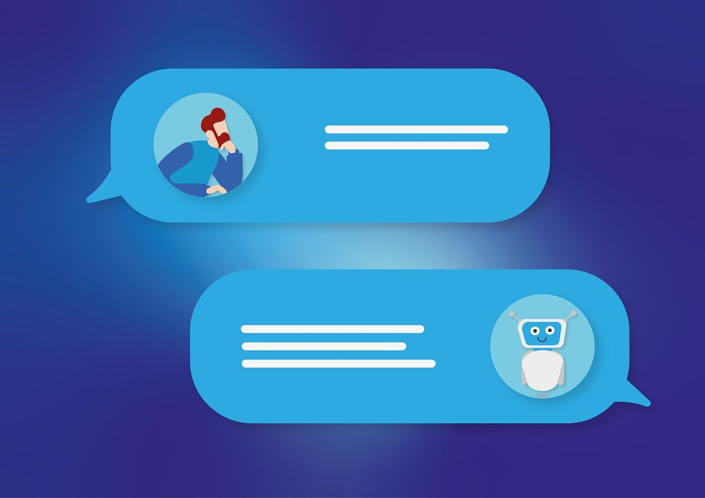
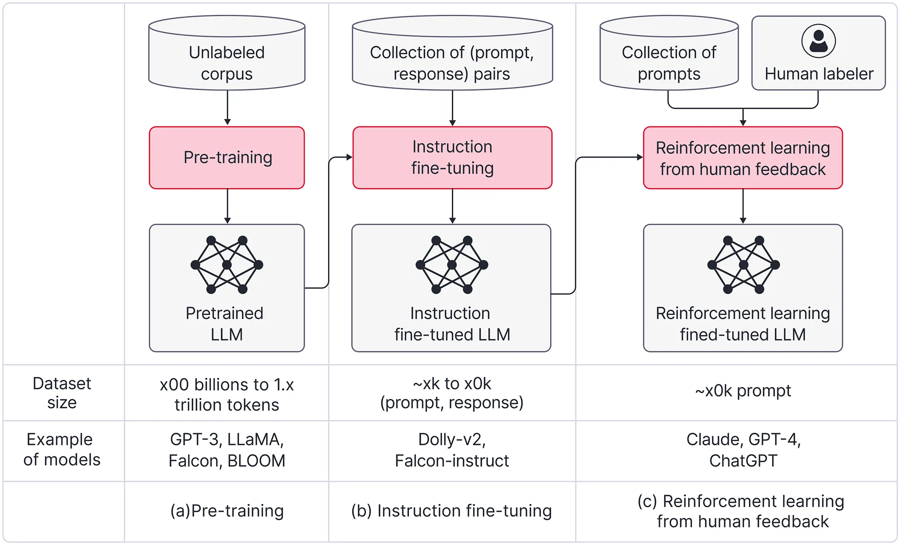
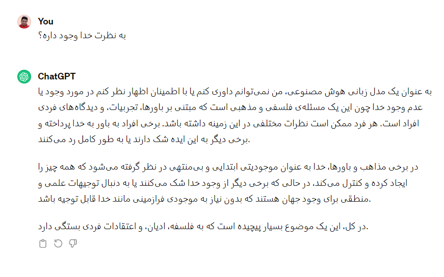
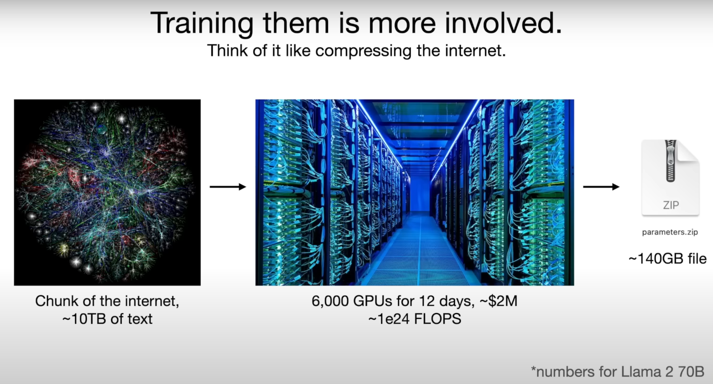

فکر می‌کنم حتی اگر اخبار هوش مصنوعی رو دنبال نکرده باشید، راجع به ChatGPT حداقل یک بار شنیدید.

زمانی ترند روز بیت‌کوین و بلاک چین بود و می‌خواستند همه رو چی با بلاک چین انجام بدن، الان ترند ChatGPT و به طور عام‌تر مدل‌های زبانی بزرگه. چیزی که علمای دیپ لرنینگ به طور خلاصه میگن LLM؛ مخفف Large Language Models.

بالاخره از قدیم‌الایام سعی داشتند که بتوانند زبان‌های بشری رو مدل‌سازی کنند و بفهمند. هر چی باشه فهم داده متنی نسبت به فهم انواع دیگه داده مثل تصویر نسبتاً راحت‌تره.

علتش هم به نظر من اینه که تصویر خیلی بی‌قاعده و بی‌نظمه. تصویر می‌تونه هر شکل و فرمی داشته باشه. از رزولوشن گرفته تا تعداد کانال و کلی پارامتر دیگه.

ولی متن به نسبت محدودتره. معنای هر کلمه تو زبان کمابیش مشخصه و قواعد زبانی هم طرز قرارگیری کلمات در کنار هم رو به شدت محدود می‌کنند.

زمانی رویکردمون نسبت به مدل‌سازی انجام یک سری کارهای از پیش تعریف شده بود؛ یعنی یک مدل درست می‌کردیم برای دسته‌بندی متن. یک مدل برای خوشه‌بندی و خلاصه می‌رفتیم برای هر کاری که داشتیم یک مدل جداگانه آموزش می‌دادیم.

البته منظورم زمان رضاشاه یا عقد دقیانوس نیست. کل بحث یادگیری عمیق و بحث‌های مرتبط ۱۰ ۱۵ سال (تقریباً از ۲۰۱۲) هست که رونق گرفته و همه این اتفاقات هم تو همین مدت اتفاق افتاده.

خلاصه از یک جایی به بعد دیدن که داریم دوباره کاری می‌کنیم. مثلاً دیدند که مدل‌هایی که برای تشخیص احساس آموزش می‌دیم با مدلی که برای دسته‌بندی نوع خبر آموزش می‌دیم، مقدار زیادی اشتراک دارند.

در واقع با بررسی‌های خیلی زیاد متوجه شدند که لایه‌های اولیه شبکه‌های عمیق تو خیلی از این تسک‌های به ظاهر متفاوت، مقادیر کمابیش یکسانی رو دارند و چیزهای یکسانی رو یاد گرفتند.

میشه اینطور بهش نگاه کرد که مدل برای این که احساس رو در متن تشخیص بده نیاز هست که ساختار جمله و معانی کلمات (مثلاً قیدهای مثبت و منفی) رو بفهمه.

پس گفتند که بریم یک سری مدل پایه زبانی (با چند صد ده میلیون یا چند صد میلیون پارامتر) درست کنیم که صرفاً زبان رو بهشون یاد بدیم و بعد از اون صرفاً می‌تونیم لایه‌های انتهایی مدل رو تنظیم کنیم و مسئله‌مون رو حل کنیم.

اتفاقاً جواب هم داد و خیلی هم خوب جواب داد. مدل‌هایی مثل Bert از این دسته هستند. انگار مدل Bert زبان انگلیسی رو یاد گرفته بود و ما با تنظیم لایه‌های آخر می‌تونستیم کار رو دربیاریم. ولی باز هم یک مشکل داشتیم و اون این بود که نیاز داشتیم برای هر تسک مجدداً لایه‌های آخر رو قدری تنظیم (Tune) کنیم.

من اینطوری میگم که ما برای Tune کردن هر مدل کافی بود، کله‌اش رو بکنیم و یه کله دیگه براش بذاریم. ولی خب خوبیش این بود نیاز نبود کل ستون فقرات و بدنش رو از نو درست کنیم. همین که کله‌اش رو می‌کندیم و کله جدید آموزش می‌دادیم کافی بود.

چیزی که میگم تو ادبیات یادگیری عمیق هم کاملآ استفاده میشه. در واقع کله همون Head هست و ستون فقرات همون Backbone. شاید براتون جالب باشه که به قسمتی که ستون فقرات رو به سر وصل می‌کنه میگیم Neck یا گردن.

از بحث منحرف نشیم. از یک جایی به بعد یک سری‌ها گفتند که چه کاریه که هی بریم کله مدل رو بکنیم؟ یه بار مثل آدم بشینیم یک مدل خوب درست کنیم و از همون استفاده کنیم برای همه چیز!

اینجا بود که مدل‌های زبانی بزرگ بوجود اومدند. بزرگ که میگم به این معنا هست که تعداد پارامترهای مدل از میلیون به میلیارد رسید. چیزی تو حدود چند ده میلیارد یا در مواردی حتی چند صد میلیارد.

همه این روضه‌ها رو خوندم که در ادامه توضیح بدم مدل‌های زبانی بزرگ چگونه آموزش داده شده‌اند. جواب دادن به این سؤال یک سال پیش به مراتب سخت‌تر بود ولی الان با تحقیق‌هایی که تو این حوزه انجام شده میشه حرف‌هایی راجع بهشون زد.

## آموزش مدل‌های زبانی بزرگ

خب. آموزش‌دادن این مدل‌ها سه تا فاز داره.

- پیش آموزش (Pre-training)
- تنظیم دقیق (Fine-tuning) یا Instruction tuning
- یادگیری تقویتی با فیدبک انسانی یاReinforcement learning with human feedback

این تصویر از سایت OpenAI خیلی واضح‌تر و شفاف‌تر مسئله رو توضیح میده. 

## پیش‌ آموزش مدل 

خب اولین فاز اینه که بیایم به مدل زبان‌ رو یاد بدیم. این زبان می‌تونه زبان‌های انسانی یا حتی زبان‌های برنامه‌نویسی باشه. سؤال اینه که چطوری یک زبان رو به کامپیوتر یاد بدیم؟ در واقع چطوری یک زبان رو مدل‌سازی کنیم؟

محققان اینجا فهمیدند که یکی از روش‌های یاد دادن زبان به کامپیوتر از طریق، «پرکردن کلمات» هست! همون چیزی که تو دبستان به ما یاد می‌دادند و می‌گفتند که «جاهای خالی را با کلمات مناسب پر کنید». 

بگذارید مثال بزنم. ما به سادگی می‌تونیم متن‌های ویکی‌پدیا و سایت‌های خبری و بسیاری سایت‌های دیگه رو خزش (Crawl) کنیم و میلیون‌ها پاراگراف مثل پاراگراف زیر بدست بیاریم. 

بعد از اون میایم بصورت کاملاً تصادفی درصدی از کلمات رو Mask می‌کنیم. یعنی اون کلمه رو خالی می‌گذاریم. چیزی شبیه این. 

خیلی بخوام ساده و البته غیرعلمی‌اش کنم، اینطوری میشه که به مدل یک دیکشنری از کلمات فارسی رو میدیم و بهش می‌گیم که سعی کن از بین این کلمات، کلمه مورد نظر رو حدس بزنی! یک اسم باکلاس هم برای این کار می‌گذاریم و بهش می‌گیم Masked Word Prediction. 

شاید براتون سؤال پیش بیاد که این کار چه ربطی به درک زبان داره؟ و اصلاً چرا باید مدل با همچین کاری توانایی درک زبان رو بدست بیاره؟

در واقع اگر بخوام جواب این سؤال رو بدم باید کل تاریخچه فیلد NLP یا پردازش زبان‌های طبیعی که یکی از شاخه‌های هوش‌مصنوعی هست رو مرور کنم؛ ولی بیاید موردی همون پاراگراف بالا رو بررسی کنیم. 

برای این که مدل بتونه کلمه «اینترنتی» رو بعد از دانشنامه تشخیص بده، نیاز هست که جمله بعد رو هم بخونه و ببینه که راجع به اینترنت و همچنین انتشار جهانی صحبت شده. 

یا این که بتونه تشخیص بده، کلمه بعد از اینترنت بهتره «آزاد» باشه و مثلاً «حسین» نباشه، نیاز به توانایی بالایی در زبان هست. خیلی وقت‌ها نیاز هست که Context کلمه کاملاً درک بشه و جملات قبل و بعد در نظر گرفته بشه. 

این کار به مراتب کار پیچیده‌ای هست. حداقل مدل‌هایی که با همین روش آموزش دیدند، نشون دادند که میشه تقریباً همه زبان‌های انسانی (!) رو با همین روش ساده به مدل‌های کامپیوتری یاد داد. 

خوبیش اینه که هزینه این کار برای ما بسیار کمه. میشه برنامه‌هایی بنویسیم که بخش بزرگی از اینترنت به خزش (Crawl) کنند و بعد بیایم بصورت تصادفی درصدی (مثلاً ۱۰ درصد) از کلمات رو تو بیندازیم و بعد به مدل یاد بدیم که درست حدس بزنه. اینجا هر بار مدل اشتباه حدس زد، اشتباهش رو بهش یادآوری می‌کنیم و کلمه درستش رو هم بهش می‌دیم و مدل خودش رو آپدیت می‌کنه. 

چیزی که نباید ازش غافل بشیم اینه که این‌کار هزینه سخت‌افزاری بسیار زیادی داره. مدل‌های امروزی با حجم بسیار زیادی از متن آموزش می‌بینند (مثلاً ۱۰ ترابایت). برای این که درک درستی از ۱۰ ترابایت متن داشته باشید، اینطوری بهتون بگم که من زمانی ۳۳۰ هزار مقاله از سایت خبری عصر ایران رو خزش کردم و فقط متن‌ها رو درآوردم و [اینجا](https://www.kaggle.com/datasets/amirpourmand/asriran-news) ذخیره کردم و حجم دیتاست، ۱ گیگابایت شد. در نظر بگیرید که خبرهای عصر ایران معمولاً هر کدوم طول زیادی (چندین پاراگراف بزرگ) دارند. 

## تنظیم دقیق با دستور
بسیار خوب. الان مدلی داریم که بلده که جاهای خالی را با کلمات مناسب پر کنه! دقیقاً همون‌کاری که تو سال اول و دوم ابتدایی خودمون انجام می‌دادیم. 

الان این بچه بزرگ شده و می‌خواد بره راهنمایی و گیر معلم بداخلاقی افتاده. اگر یادتون باشه، تو دوره تحصیلی بعضی معلم‌ها ازمون می‌خواستند که جواب سؤال رو موبه‌مو و عیناً همون چیزی بدیم که بهمون گفتند. 

مثلاً اگر می‌گفتند که تاریخ چیست؟ باید می‌گفتیم که:

> منظور از تاریخ، مجموعهٔ رخدادهای فرهنگی، طبیعی، اجتماعی، اقتصادی و سیاسی و رویدادهایی است که در گذشته و در زمان و مکان زندگی انسان‌ها و در رابطه با آن‌ها رخ داده‌است.

این تعریف رو از ویکی‌پدیا برداشتم و قطعاً خودم هم حفظ نیستم ولی خب کل دوران تحصیل ما تو مدرسه به حفظ کردن مطالبی از این دست گذشت. هیچ‌کدومش رو هم واقعاً یادمون نمونده. دقیقاً هم یادمه که استاد تاریخی که داشتیم، از ما می‌خواست عین کتاب و بدون جا انداختن حتی یک نقطه، جواب بدیم. 

حالا ما همین‌کار رو از مدل می‌خوایم که برامون انجام بده! یک مجموعه‌ای از سؤال و جواب نسبتاً طولانی درست می‌کنیم و ازش می‌خوایم که بهمون جواب میده. 

تو این مرحله تعداد سؤال جواب‌هایی که لازمه در حد چند میلیون خواهد بود. چیزهایی شبیه این: 

خیلی هم خوب یاد می‌گیره و الان مدلی داریم که می‌تونه به سؤالاتمون جواب بده. فکر می‌کنم هممون همچین حسی داشتیم که این که صرفاً بشینیم یک چیزی رو حفظ کنیم، به درد هیچی نمی‌خوره و خب الان می‌بینیم کامپیوتر به این مرحله رسیده. 

حالا می‌تونید از این مدل بدست اومده هر چیزی راجع به جغرافیا و اقتصاد و فیزیک و بسیاری از رشته‌های دیگه بپرسید و به خوبی هم جواب میدن. حتی می‌تونید احکام بپرسید و راجع به احکام دینی ازشون اطلاعات دریافت کنید یا این که راجع به فلان تسک توی زبان طبیعی بپرسید. 

این‌ها سعی می‌کنند با دانشی که تو مرحله قبل و این مرحله راجع به دنیا بدست آوردند، چیزهایی تولید کنند. 

ولی برای این مرحله محدودیت‌های زیادی داریم؛ چون ما تعداد کمی مجموعه داده از سؤال جواب‌های متنوع داریم. ما نیاز به مجموعه دادگانی از رشته‌های مختلف داریم که همه نوع سؤالی داخل‌شون باشه. از سؤال سخت و پیچیده تا سؤال‌های ساده و پیش پا افتاده که هر بچه‌‌ای بلده بهشون جواب بده. 

دقت کنید که تو مرحله قبل چون صرفاً بصورت تصادفی یک سری کلمات رو از جمله حذف می‌کردیم، تولید کردن مجموعه داده کار بسیار ساده‌ای بود. ولی الان چون نیاز به «انسان» و «هوش انسانی» برای تولید سؤال جواب داریم، این کار به شدت سخت و هزینه‌بر خواهد بود. 

به هر حال الان نسبت به دو سال پیش حجم داده بسیار زیادی تولید شده و محدودیت این مرحله‌ هم تا حد زیادی حل شده. 
## یادگیری تقویتی با فیدبک انسانی
تا حالا راجع به بچه‌‌ای صحبت کردیم که دوران مدرسه‌اش رو به اتمام رسوند و کلی مطالب حفظ کرده و تازه می‌خواد وارد دانشگاه بشه! 

بچه‌مون باید کم‌کم بزرگ بشه و یاد بگیره که درست نیست هر حرفی رو هر جایی بزنه! باید بفهمه که به سادگی نمیشه راجع به مسائل سیاسی و مذهبی و جنسی نظر بده! تو این موارد باید محتاط باشه. 

مثلاً اگر ازش راجع به خدا و فلان شخصیت مذهبی پرسیدیم، نباید نظر رادیکال بده. 

در واقع باید بهش یاد بدیم که جوری حرف بزنه که اکثر آدم‌ها (چه بسا همه آدم‌ها) خوششون بیاد و حداقل ناراحت نشن. 
دقیقاً به همین شکل! این جواب نه چیزی به من و شما اضافه می‌کنه و نه فایده‌ای داره؛ ولی جوری جواب داده که تقریباً هیچ کسی نمی‌تونه بگه من مخالفم. یه سری کلی‌گویی کرده و خیلی ریز از زیر مسئله در رفته. 

این چیزی هست که ما تو دانشگاه یاد می‌گیریم! یاد می‌گیریم چطوری از زیر نظردادن راجع به مسائلی که حساسیت ایجاد می‌کنند در بریم. 

سؤال اینه که چطوری این رو یاد می‌گیره؟ خب اینجا مدل قدری پیچیده‌تر میشه و یک «مدل تقویتی» از خوشایند اکثر انسان‌ها درست می‌کنه و سعی می‌کنه جملاتی رو بگه که خوشایند اکثر انسان‌ها باشه. 

با اون دکمه لایک و دیسلایک پایین جواب مدل هم یک مجموعه داده از جواب‌های خوب و بد براش درست میشه. البته اینجا دیگه به مدل بیشتر اعتماد داریم و دستش رو باز می‌گذاریم که خودش کم کم بفهمه که چه حرف‌هایی رو نباید بزنه و چه حرف‌هایی حساسیتی ایجاد نمی‌کنند.

تو این فاز یک مدل قدرتمند مثل ChatGPT داریم که حالا می‌تونیم تو کسب و کار خودمون ازش استفاده بکنیم. تو فاز بعدی می‌خوایم که مدل رو از دانشگاه بیرون بیاریم و حالا تازه کنار دستمون تو شرکت استخدامش کنیم و مثلاً به عنوان یک دستیار ازش استفاده کنیم! 

اگر بخوام فاز بعدی مدل‌ رو توضیح بدم باید وارد بحث RAG و Finetuning بشم که ترجیح میدم در یک پست جداگانه راجع به این قضیه صحبت کنم. 

## هزینه آموزش مدل
دوست داشتم یک صحبتی هم راجع به هزینه آموزش این مدل‌ها بکنم. 

طبق چیزی که تو تصویر بالا هم اومده (تصویر رو از [این ویدئو](https://www.youtube.com/watch?v=zjkBMFhNj_g&t=284s) برداشتم)، هزینه آموزش این مدل‌ها فقط برای یک بار آموزش چیزی حدود ۲ میلیون دلار هست که این عدد برای مدل‌های صنعتی حدود ۱۰ برابر هست. 

یعنی مثلاً ۲۰ میلیون دلار هزینه یک بار آموزش مدل‌ها هست که اگر بخوایم با دلار ۵۰ هزارتومن حساب کنیم میشه هزار میلیارد تومن! 

یعنی ما ۱۰ ترابایت تکست و داده متنی رو با هزاران GPU آموزش میدیم و خروجی یک فایل (مثلاً ۱۰۰ گیگابایتی) بدست میاریم که این انگار خلاصه کل اینترنت هست. یعنی کل داده‌های بشری رو تونستیم به نوعی داخل این فایل قرار بدیم. 

در نظر بگیرید که پیچیدگی‌های انجام این کار بسیار بسیار زیاده و کار هر کسی نیست. شرکت ChatGPT که همچین مدل‌هایی رو آموزش داده نزدیک ۸۰۰ تا کارمند داره که تخصصی روی همین‌ چیزها کار می‌کنند. 

البته اینطور هم نیست که حالا که هزینه انقدر سرسام‌آور هست، هیچ راه حلی نداشته باشیم. خدا رو شکر جامعه متن‌باز گسترش پیدا کرده و آدم‌ها دور هم جمع شدند و راه‌حل‌هایی خوب برای حل این مسئله دادند. ولی می‌خوام بگم که هزینه انقدر زیاد هست که هر کسی نباید به این فکر کنه که حالا با ۵ تا GPU ای که دارم بشینم یه مدل زبانی بزرگ آموزش بدم که از ChatGPT هم بهتر بشه. 

البته شرکت‌هایی بزرگی تو دنیا داریم که این اعداد براشون چیزی نیست و حاضرن خیلی بیشتر از این‌ها هم سرمایه‌گذاری کنند و می‌کنند؛ ولی می‌خوام بگم کار هر کسی نیست. 

فکر می‌کنم برای امروز زیاد شد. ادامه این پست، دو تا پست باید بنویسم. یکی راجع به روش‌های متن‌باز و چگونگی توسعه‌شون و دیگری راجع به این که چطوری آدم‌ها مدل‌های زبانی بزرگ (که فقط دانشگاه رفتند و مطلب حفظ کردند) رو می‌تونند برای کسب و کارهای خودشون استفاده بکنند. 

