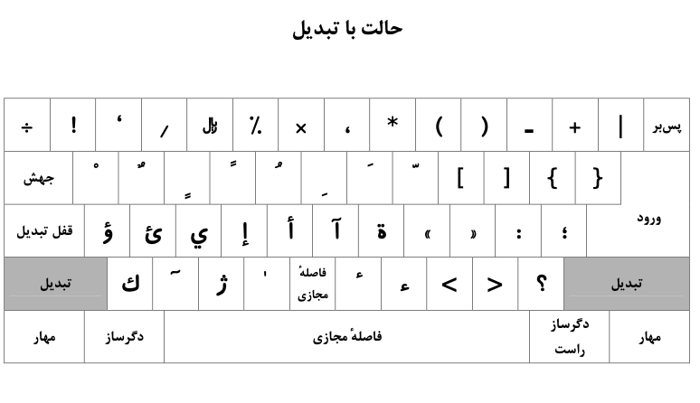
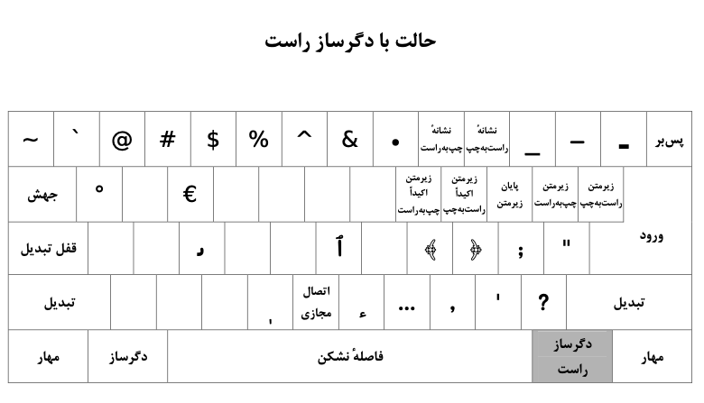

چند وقت پیش، همین طوری داشتم تو اینترنت می‌گشتم به [این مطلب](https://utype.ir/blog/صفحه-کلید-استاندارد-فارسی/) برخوردم و بعد تو [PDFای](https://utype.ir/wp-content/uploads/2021/12/9147.pdf) که صفحه‌کلید استاندارد فارسی رو تصویب کرده بودند، دیدم که علاوه بر Shift کلید Alt (Option در مک) هم برای تایپ کاراکترهای خاص کاربرد داره. 

دو تا تصویر بالا کاملاً مشخصه. کارکرد کلید شیفت رو همه می‌دونیم اما کلید Option یا Alt هم کارکردهای مفیدی داره. 

مثلاً من قبلاً هنگامی که تو فارسی به کاراکتر # (هشتگ) نیاز داشتم، اول صفحه کلید رو انگلیسی می‌کردم و بعد تایپش می‌کردم. در حالی که به سادگی میشد کلید Alt (Option) + 3 رو فشار بدم.

یا مثلاً برای تایپ هوش_مصنوعی (به همراه underline) باز کیبرد رو انگلیسی می‌کردم و کاراکتر underline رو تایپ می‌کردم و دوباره برمی‌گشتم. این مسئله برای تایپ عبارتی مثل ( #توسعه_فردی) هم باز پیش میاد و این کلید بسیار کمک‌کننده است. 

از اونجایی که مطمئن نبودم کاراکتر Underline دقیقاً درست تایپ شده، تو فایل استاندارد و تو صفحه‌کلید، کد Unicodeاش رو هم چک کردم و دقیقاً درست بود ([U+005F](https://www.compart.com/en/unicode/U+005F)). 

تو مک این قضیه بدون نصب هیچ‌گونه نرم‌افزار یا کار خاصی انجام شد؛ ولی ظاهراً به دلایل نامعلومی ویندوز صفحه‌کلید استاندارد فارسی رو کامل پیاده‌سازی نکرده و با زدن کلید Alt (یا همون دگرساز راست) اتفاقی نمی‌افته. 

اگر حوصله دانلود کردن و خوندن PDF رو ندارید، این سایت هم می‌تونه مفید باشه که صفحه کلید استاندارد فارسی رو به درستی پیاده‌سازی کرده. 

- [Type Farsi Keyboard | Persian Keyboard ™ صفحه کلید فارسی](https://gate2home.com/Farsi-Persian-Keyboard)

نکتهٔ دیگری هم که به نظرم جالب بود، کاراکتر سه‌نقطه (…) بود. من فکر می‌کردم باید سه‌ تا نقطه تایپ کنیم (...) ولی همین‌طوری که مشخصه خروجی‌اش کمی فرق داره. به درد من که نمی‌خوره ولی شاید برای تایپ کتاب و نوشته‌های حرفه‌ای مناسب‌تر باشه.  

پی‌نوشت: اگر خواستید جستجو کنید و راجع به این موضوع بیشتر بدونید، به مجموعه کاراکترهایی با زدن Shift فعال میشن، طرح مرتبه دوم (Second Level Keyboard Layout) میگن و به مجموعه کاراکترهایی که با Alt فعال میشن، طرح مرتبه سوم (Third Level Keyboard Layout) میگن.

فوروم‌های متعددی هم هست که افراد راجع به این قضیه گزارش دادند ولی جوابی از سمت مایکروسافت نیومده. تو این سایت هم اگر نگاه کنید، کلید شیفت به درستی پیاده‌سازی شده ولی Alt پیاده‌سازی نشده. 

- [Persian (Standard) Keyboard - Globalization | Microsoft Learn](https://learn.microsoft.com/en-us/globalization/keyboards/kbdfar)
- [ایزیری ۹۱۴۷ - ویکی‌پدیا، دانشنامهٔ آزاد](https://fa.wikipedia.org/wiki/%D8%A7%DB%8C%D8%B2%DB%8C%D8%B1%DB%8C_%DB%B9%DB%B1%DB%B4%DB%B7)
- [صفحه‌کلید استاندارد فارسی (مایکروسافت) - ویکی‌پدیا، دانشنامهٔ آزاد](https://fa.wikipedia.org/wiki/%D8%B5%D9%81%D8%AD%D9%87%E2%80%8C%DA%A9%D9%84%DB%8C%D8%AF_%D8%A7%D8%B3%D8%AA%D8%A7%D9%86%D8%AF%D8%A7%D8%B1%D8%AF_%D9%81%D8%A7%D8%B1%D8%B3%DB%8C_(%D9%85%D8%A7%DB%8C%DA%A9%D8%B1%D9%88%D8%B3%D8%A7%D9%81%D8%AA))

جدیداً راجع به فونت‌ها هم کمی این‌طرف اون‌طرف نگاه کردم ولی چیز خاصی دستگیرم نشد. اینطور که فهمیدم حداقل سه نوع فونت فارسی سری B و سری XB و سری IR داریم که نوع سوم برام کالاً جدیده. 
- [قلم‌های سالم فارسی | فونت IR آی‌آر - ویراستاران](https://virastaran.net/abzar/124/)
- [Saber Rastikerdar - Opensource Projects](https://rastikerdar.github.io/)

